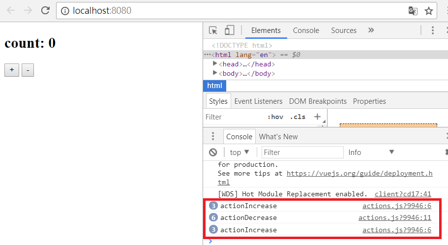
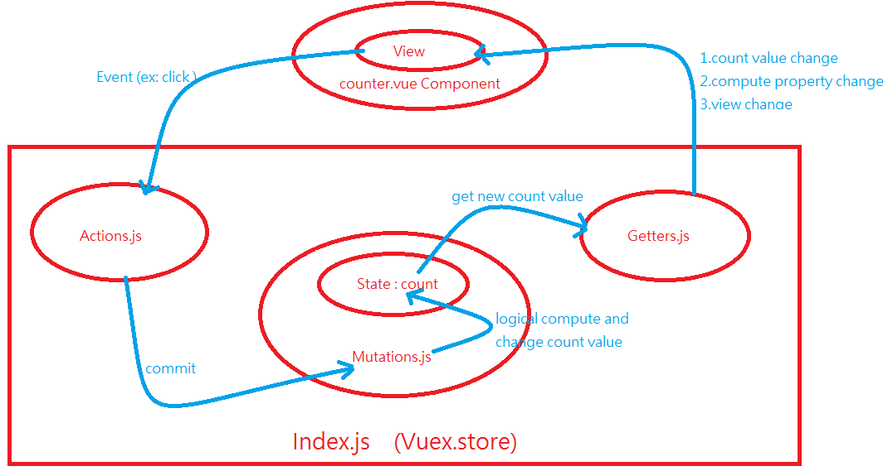

# Part 10 Vuex(組件之間的狀態管理)

**Vuex** 是一個專為 Vue.js 應用程式所開發的狀態管理模式，它會**負責管理整個應用程式中各個組件的狀態值(Data)，而且以某種你必需要遵守的規則來保證狀態值(Data)的改變是可預測的**。然而，為什麼我們需要一個統一的狀態值(Data)管理機制以及使用Vuex呢：

* 在大型系統的應用中，組件數量可能很多，而組件之間重複使用到的資料一定更多，這樣各個組件切換之間如何確定拿到同一筆資料呢？**因此我們需要一個集中所有資料的地方：store(統一的狀態值管理機制)**。

* 雙向資料流，簡單靈活，可是發開到後期，團隊人數一多，專案一趕，就會產生難以理解的 code 且因為雙向綁定的關係，造成迴圈跑了多次，結果不容易預期，debug 不容易的狀況...。是不是有一種流程，或者一種設計模式可以幫我們解決這樣的事情呢？**單向資料流(統一的資料流向)**。

* 我們在元件裡面觸發的不同行為，是不是有一個框架可以幫我整理所有的行為呢？**actions(統一的觸發事件)**。

以上的問題，**vuex**(基於單向資料流 Flux 設計模式 在 Vue 框架中的實作)是一種解答：

> Vue + flux = vuex

## 10.1 Flux Design Pattern

考處一個簡單的以Vue撰寫的計數器，HTML如下：
```
<body>
    <div id="app">
　　 <!--這是View部份所單向綁定的數據-->
        <p>{{ count }}</p>
        <p>
            <button @click="increment">+</button>
            <button @click="decrement">-</button>
        </p>
    </div>
</body>
```
JavaScript如下：
```
new Vue({
    // view
    el: '#app',
    // state      
    data() {    
        return {      
            count: 0    
        }  
    },
    // actions
    methods: {    
        increment() {      
            this.count++
        },
        decrement() {      
            this.count--   
        }
    }
})
```
由上述可以看到包含以下幾個部分：

* state(data)：即data中的count值，一個數據源；

* view：即```<p>{{ count }}</p>```，將state(data)映射到視圖；

* actions，即methods，響應在view上的使用者輸入，而導致的state(data)變化。

以下是一個表示"Flux設計模式的單向數據流"理念的極簡示意：


**上圖解釋，所有的動作都是從 action 出發，接著到了 store 把結果存起來改變 state 然後因為 state 改變了，所以 view（元件或頁面）就會跟著改變。重點是這一連串的行為是不可逆的，即不能因為view的改變而改變 state，故稱為：單向資料流。**

## 10.2 Vuex( Vue + Flux )由來

當我們的大型應用程式遇到多個組件共享同一個狀態(Data)時，單向數據流的簡潔性、單純性、可追踪性、可維護性...等等，很容易遭到破壞：

1. 多個View可能都依賴於同一個state(data)值來展示自己。

2. 這些來自不同View的操作行為需要變更同一個state(data)的值。

因此，為什麼不把各個組件之間所要共享的state(data)抽取出來，以一個**全域的單例模式管理(singleton pattern)**，在這種模式下，即使組件數量再龐大，也能保證任何一個組件都能經由這個全局的單列實體來獲取state(data)或者觸發改變state(data)的行為，並且這些行為都是經過統一的管控及限制。以上這些就是**Vuex**的功能：


在 vuex 的設計中，view（元件或頁面）的變化不是他的職權範圍，這塊單純的讓 vue（專業的）去控制，因此在上面這張圖裡面，有一個塊綠色虛線所包含的內容才是 vuex 的工作項目，與 Vue 的工作完全沒有重疊，各司其職的搭配。

* **Actions**：定義了整個應用程式的行為如：按下 login 這顆按鈕，它是一個 action！現在我們要開始登入囉！這樣的行為通常需要與 server 溝通，因此 call API 的行為(Ajax非同步)也會在 action 中執行！

    > **它使用 commit 向 Mutations 溝通(傳遞資料)**。

* **Mutations**：負責接收 action(commit) 資料並計算邏輯後改變 State。

	> 只有 mutation 可以改變 state！

* **State**：負責記錄應用程式所有的共享之 State 狀態值。

* **actions -> commit -> mutations**：actions一定要經過commit告知mutations改變state之值。actions不能自己改變state之值，否則就跟原來的架構一樣了，組件各自改變state之值，沒有統一的行為管理機制。

為什麼不能把actions這一層拿掉，直接在Mutations這一層也來統一處理actions該做的事，因為actions和mutations還是存在各自應該做的職責：

* action: 可以處理**非同步(Ajax)**的事件，再利用 commit 與 mutation 溝通。

* mutation: 在處理事件是**同步**的。

有上述這樣的職責劃分是為**確保state的值是即時性的**：

* action

    1. Ajax call API。

    2. 等待server回應新的資料值。

    3. server回應新的資料值。

    4. commit告知mutations用新的資料值來改變 state 狀態值。

* mutation

    5. 計算邏輯改變 state 狀態值。

把非同步呼叫(Ajax call API)往前一層到 action 去處理的話，就可以**保證到了 mutation 資料都是即時的**，計算後的狀態也是現在進行式。

套用Vuex後的登入流程大概如下：

<table>
  <tr>
    <td>步驟</td>
    <td>流程描述</td>
    <td>Flux(vuex) 流程</td>
  </tr>
  <tr>
    <td>1</td>
    <td>在登入頁按下 login 按鈕。</td>
    <td>VueJS</td>
  </tr>
  <tr>
    <td>2</td>
    <td>按鈕觸發 action。</td>
    <td>action</td>
  </tr>
  <tr>
    <td>3</td>
    <td>action 調用 login API。</td>
    <td>action</td>
  </tr>
  <tr>
    <td>4</td>
    <td>server response success 帳號密碼正確。</td>
    <td>action (commit)</td>
  </tr>
  <tr>
    <td>5</td>
    <td>接收 action 資料，計算邏輯，改變狀態。</td>
    <td>mutation</td>
  </tr>
  <tr>
    <td>6</td>
    <td>State 改變 ex: login: true or token: '3345678'。</td>
    <td>state</td>
  </tr>
  <tr>
    <td>7</td>
    <td>state 改變，所以View改變，即轉跳到 index 頁面。</td>
    <td>VueJS</td>
  </tr>
</table>

## 10.3 簡單的Vuex之計數器範例 

每一個 **Vuex** 的核心就是 **store（倉庫）**。 **"store" 基本上就是一個容器**，**它包含著你的應用中大部分的狀態(state)**。 Vuex 的store物件和單純的全域物件有以下兩點不同：

* Vuex 的狀態存儲是響應式的。當 Vue 組件從 store 中讀取state的時候，若 store 中的state發生變化，那麼相應的組件也會相應地得到高效更新。

* 你不能直接改變 store 中的state。改變 store 中的狀態的唯一途徑就是提交(commit) mutations。這樣使得我們可以方便地跟踪每一個狀態的變化，從而讓我們能夠實現一些工具幫助我們更好地了解我們的應用。

創建一個 store的過程直接了當，僅需要提供一個初始 state 對象和一些 mutations：
```
const store = new Vuex.Store({
  state: {
    count: 0
  },
  mutations: {
    increment (state) {
      state.count++
    }
  }
})
```
現在可以通過 store.state 來獲取store物件的state值，並且可以通過 store.commit 方法觸發狀態變更(Mutations)：
```
store.commit('increment')
console.log(store.state.count)
```
再次強調，我們通過**提交 mutation** 的方式，而**非直接改變 store.state.count**，是因為我們想要更明確地追踪到狀態的變化。這個簡單的約定能夠讓你的意圖更加明顯，這樣你在閱讀代碼的時候能更容易地解讀應用內部的狀態改變。

> 由於** store 中的狀態是響應式的**，在組件中調用 store 中的狀態簡單到僅需要在計算屬性中返回即可。觸發變化也僅僅是在組件的 methods 中提交 mutations。

在10.1節中，我們很單純的使用VueJS寫了一個很簡單的加減法計數器，現在我們把它用Vuex來改寫，想像count(計數器的值)就是我們要讓各個組件之間共享的狀態值，把改寫的計數器和10.1節的程式碼對照著看，很容易感受到其中的差別，完整***[counter-basic-vuex.html](./counter-basic-vuex.html)***範例如下所示：
```
<!DOCTYPE html>
<html>
<head>
    <meta charset="UTF-8">
    <title>counter-basic-Vuex</title>
</head>
<body>
    <div id="app">
        <p>{{ computed_count }}</p>
        <p>
            <button @click="increment">+</button>
            <button @click="decrement">-</button>
        </p>
    </div>
</body>
<!--使用引入JS檔的方式來引入Vue.js-->
<script src="https://cdnjs.cloudflare.com/ajax/libs/vue/2.3.4/vue.min.js"></script>
<!--使用引入JS檔的方式來引入Vuex.js-->
<script src="https://cdnjs.cloudflare.com/ajax/libs/vuex/2.3.1/vuex.min.js"></script>
<script>
//宣告一個全域的狀態管理容器(Store)
const store = new Vuex.Store({
    //宣告所要管理的state值,這裡只有count
    state: {
        count: 0
    },
    //mutations用來接收actions的commit告知,並且改變state值,也只有它可以改變state值
    mutations: {
        increment(state) {
            state.count++
        },
        decrement(state) {
            state.count--
        }
        /*
            上面可能直接這樣寫
            increment: state => state.count++,
            decrement: state => state.count--
        */
    }
})
new Vue({
    el: '#app',
    //宣告一個計算屬性computed_count,只要state.count被mutations改變,則computed_count值也會改變
    computed: {
        computed_count: function() {
            return store.state.count
        }
    },
    methods: {
        increment() {
            //透過commit呼叫對應的mutations,即increment(state)
            store.commit('increment')
        },
        decrement() {
            //透過commit呼叫對應的mutations,即decrement(state)
            store.commit('decrement')
        }
    }
})
</script>
</html>
```

## 10.4 模組化建構的Vuex之計數器範例

本節中，我們將使用模組化的方式來改寫10.3節的計數器範例：

1. 使用**.vue檔案**來開發組件。

2. 將**Vuex的狀態管理機制之功能，拆分成共用的檔案**，以模組化方式實現共享狀態管理機制。

### 10.4.1 建置Vue專案及安裝Vuex模組

使用***[Part 9](./Part8&9_VueFile&ENV#part-9-%E9%96%8B%E7%99%BC%E7%92%B0%E5%A2%83%E7%9A%84%E9%83%A8%E7%BD%B2)***的說明方式，用vue cli建立一個Vue專案以及引入相關模組的安裝，在此我們不再特別說明之，我們選用一個Counter目錄來建置，成功後目錄結構如下圖：


若你打開上圖中的node_modules資料夾，你會發現沒有所謂Vuex字眼的模組，這是因為Vuex不是VueJS的必要相依模組，因此npm在安裝相依模組時，不會將它納入進來。**安裝Vuex相依模組**指令如下：

```npm install vuex --save```

安裝成功如下圖示：


新版的Vuex某些地方使用ES7來撰寫會相當方便，所以我們的程式會用到ES2015(ES6)及ES7的語法，它們也是JavaScript所擴充的語法而已，不過ES7的語法太新了，因此你必需再安裝一個套件，即**babel-preset-stage-3**：

```npm install babel-preset-stage-3 --save--dev```

安裝成功如下圖示：


然後你必需在**Counter這個Vue專案目錄中的.babelrc檔**中多加入**’stage-3’**如下：


至此，我們開發的所有事前動作皆已準備完畢。

接著，我們在**src目錄下新增三個資料夾**，分別為：

* component：負責存放系統中的所有組件(一堆**.vue檔**的組件集合)。

* page：負責存放由組件所組成的各種頁面(一堆**.vue檔**的頁面集合)。

* store：負責存放Vuex之各種狀態管理的模組檔(一堆**.js檔**的模組集合)。模組包括

    * actions.js：即提供各組件使用的所有**觸發動作之集合**，它們會對mutitions做commit的動作。

    * mutations：即所有**改變狀態****值****動作之集合**，它們會負責接收來自actions的commit通知。

    * getters.js：即提供各組件使用的所有**取得狀態值方法之集合**，它們會被組件放在計算屬性中，因此只要狀態值一改變，相應的View也會改變。

    * index.js：**負責建立Vuex的store實體**，當中包括指定state、mutations、getters、actions(即上述檔案之內容)，**當store被某個組件引用時**，**預設就是先找這支檔案來執行**，**因此只有這支檔案的名稱(index.js)不可以改變**。

    * mutations_type.js：可有可無，它只是負責記載型態而已，action 與 mutation 中間溝通的對應表，當系統成長到一定的程度，防止 mutation key 重複，造成不可預期情況發生，也有防呆作用。

### 10.4.2 mutations.js (mutation & state)

在**mutations.js**中，是**負責存放 state 與 mutation 函式**，我們**存放INCREASE及DECREASE兩個mutation**，它們會**分別讓actions的actionIncrease及actionDecrease來呼叫**，呼叫是透過**commit**。最後**輸出mutations及state以供index.js在建立Vuex.store實體時使用**，***[mutations.js](./Counter/src/store/mutations.js)***內容如下：
```
import * as types from './mutations_type.js'
// state
export const state = {
    count: 0
}
// mutations
export const mutations = {
    // action 發出 commit 會對應到 mutation 使用的是 Object key 方式
    [types.INCREASE](state) {
        // 在 mutation 改變 state（只有 mutation 可以改變！）
        state.count += 1;
    },
    [types.DECREASE](state) {
        // 在 mutation 改變 state（只有 mutation 可以改變！）
        state.count -= 1;
    },
}
```
### 10.4.3 actions.js

在**actions.js**中，是**負責存放 action 函式**，我們**存放及輸出actionIncrease及actionDecrease**這兩個函式，可以看到它們必須經由commit動作來通知mutations，而mutations才是真正改變共享全域狀態的地方。它們可以**讓要使用Vuex狀態管理機制的組件來使用**，***[actions.js](./Counter/src/store/actions.js)***內容如下：：
```
import mutations from './mutations'
// 引入 mutations_type （引用同一個 key）
import * as types from './mutations_type.js'
export const actionIncrease = ({ commit }) => {
    console.log('actionIncrease');
    commit(types.INCREASE);
}
export const actionDecrease = ({ commit }) => {
    console.log('actionDecrease');
    commit(types.DECREASE);
}
```
### 10.4.4 mutations_type.js

這個檔案只是負責讓**mutations.js和actions.js之間有個對應表**而已，這樣比較好維護，尤其是當你mutations及actions的數量衍生成很龐大的時候，***[mutations_type.js](./Counter/src/store/mutations_type.js)***內容如下：：
```
export const INCREASE = 'INCREASE';
export const DECREASE = 'DECREASE';
```
### 10.4.5 getters.js

在**getters.js**中，主要是用來**存放及輸出getter 函式**，**它會返回 state 以提供組件使用**，***[getters.js](./Counter/src/store/getters.js)***內容如下：：
```
export const getCount = state => {
    return state.count }
```
### 10.4.6 index.js

這支**index.js**最為重要，它是整個**Vuex.store(狀態管理系統)的核心**：

1. 負責**建立Vuex.store實體**，建立時需要上述各小節的檔案或模組。

2. 當**Vuex被某個組件引用時**，**此時它會立刻去對應的資料夾中找到index.js**，即在main.js中的import store from './store'，表示到store資料夾下自動載入index.js來執行。

***[index.js](./Counter/src/store/index.js)***內容如下：
```
import Vue from 'vue'
import Vuex from 'vuex'
import { state, mutations } from './mutations.js'
import * as getters from './getters.js'
import * as actions from './actions.js'
//一定要調用Vuex進來!!!
Vue.use(Vuex);
//宣告一個狀態管理容器(Store)
export default new Vuex.Store({
    state,
    mutations,
    getters,
    actions,
    // 嚴格模式，禁止直接修改 state
    strict: true
});
```
### 10.4.7 count.vue

這支檔案就是**真實的計數器內容之程式碼**，上面各小節的檔案內容只是我們把Vuex.store的狀態管理機制之部份拆成模組化檔案而已，**在counter.vue中，我們會去Vuex拿取**：

* mapGetters：即getters.js檔中的各函式，此範例只有一個getter函式，它會用在counter.vue組件中的computed property(計算屬性)，好讓我們達成只要getter取回的狀態值一改變，則被計算屬性綁定的view介面也立刻作出變動。

* mapActions：即actions.js檔中的各函式，此範例有actionIncrease及actionDecrease兩個函式，它們會用在counter.vue組件中的methods，而這些methods最終會被view上的元素來呼叫。

***[count.vue](./Counter/src/page/count.vue)***內容如下：
```
<template>
    <div>
        <h2>count:<span> {{ count }}</span></h2>
        <button @click="actionIncrease"> + </button>
        <button @click="actionDecrease"> - </button>
    </div>
</template>
<script>
/*
    引用 vuex
    mapActions 在 computed 中使用，提取 action 函式的方法，使用函式名稱
    mapGetters 在 methods 中使用，提取 getter 函式的方法，可以利用物件 key: value 方式取別名
*/
import {
    mapGetters,
    mapActions
} from 'vuex'

export default {
    //ES7的寫法
    computed: {
        ...mapGetters({
            // getCount return value 將會存在別名為 count 的 data 上
            count: 'getCount',
        }),
    },
    /*
    一般也可以這樣寫, 但缺點是無法再宣告其它的計算屬性
    computed: mapGetters({
        count: 'getCount'
    }),
    */
    methods: {
        ...mapActions([
            'actionIncrease',
            'actionDecrease',
        ]),
        // 其他 method call action 的方法
        callAction() {
            // example
            this.actionIncrease;
        }
    }
    /*
    一般可以這樣寫, 但缺點是無法再宣告其它的方法
    methods: mapActions([
        'actionIncrease',
        'actionDecrease',
    ])
    */
}
</script>
```
### 10.4.8 App.vue

這裡要先說明一下使用VueJS來開發Web APP的目錄結構之流程，我們在10.4.1小節中的圖有提到，我們建立了component及page資料夾，這主要是要讓你分清楚那些是組件，而那些是許多大大小小組件所組成的網頁，雖然說網頁，但它其實還是一個.vue的檔案，它就是負責把需要的組件都組合起來形成一個組件式的網頁(Web Component Page)，所以組件放component資料夾來管理，而組合組件的網頁就由page資料夾來管理。至於App.vue則是所謂的根組件網頁(Web Component Root Page)，它負責串起所有page資料夾裡的網頁，由此形成一個最後的Web APP。***[App.vue](./Counter/src/App.vue)***內容如下：
```
<template>
    <div id="app">
        <counter></counter>
    </div>
</template>
<script>
import Count from './page/count.vue'
export default {
    name: 'app',
    components: {
        'counter': Count
    }
}
</script>
```
由上可以看到，它只是負責串起counter這個網頁。我們這個例子太簡單，主要是為了介紹引入Vuex，所以我們沒必要再去細分組件，因此直接是count.vue網頁即可，這個網頁底下沒有引用任何由component資料夾來的組件。

### 10.4.9 main.js

整個Web App的主程式，它負責**建立根組件Vue實體**，**以及引用app.vue和Vuex.store進來**，然後將它們綁定到id為#app的HTML元素上。特別注意的是，**當store在Vue實體被掛載進來，這表示包括Vue實體在內及其底下的所有網頁**，**還有網頁中的所有組件**，**皆會共享這個store(倉庫)**，**這相當於就是整個Web APP都能存取及共享store的狀態管理機制和其狀態值**。***[main.js](./Counter/src/main.js)***內容如下：
```
import Vue from 'vue';
// 引入 store 資料夾（裡面五隻 js ）
// 預設會去找 index.js  如果沒有的話會報錯！
import store from './store'
import App from './App.vue';
new Vue({
    el: '#app',
    /*
    	加入 store,被掛載的組件將會共享這個store(倉庫)及其下所有狀態值
		由於Vue實體為整個應用程式的根組件,因此表示這個應用程式所有組件都將共享store這個狀態管理機制
    */
    store,
    render: h => h(App)
});
```
### 10.4.10 結論

所有檔案結構圖如下：


最後使用npm run dev直接執行，或npm run build編譯出來執行，其結果如下圖：



上圖的右下角之Console可以觀察一件事，把改變狀態的工作都交由統一的地方來管理及處理，可以讓我們很方便的追踪狀態值的變化，值的變化比較不會散亂到一發不可收拾的地步。

**至此！我們建立了一系列的檔案都只有一個目的，讓我們以模組化的方式引入Vuex的狀態管理機制到VueJS的程式中，它的流程最終應該如下圖所示：**



> 最後要說明，光是一個這麼簡單的計數器範例，在引進Vuex後變的相當的複雜，這說明如果一個小型的應用，其實不適合引進Vuex，它比較適合的是中大型的專案開發。

## 10.5 簡易計算機 ( VueJS + Vuex )

本節中，我們即將承襲上一節10.4，更進一步的說明及使用Vuex。這個簡易的計算機具有加減乘除的功能，我們以下只會展示有修改的部份：

* 傳遞更多的參數給actions.js。

* 在actions.js加入更多的動作(action)。

* mutations.js接收更多來自actions.js的參數。

* 在mutations.js加入更多接收action的相應方法(mutation)。

* 在mutations_type.js加入更多的型態。

* 在computer.vue組件網頁的template中加入雙向綁定(v-model)，以及傳遞更多的參數給actions。

我們建立SimpleComputer的Vue專案(更多建立專案的細節，請參考***[Part 9](./Part8&9_VueFile&ENV#part-9-%E9%96%8B%E7%99%BC%E7%92%B0%E5%A2%83%E7%9A%84%E9%83%A8%E7%BD%B2)***說明)，建立完成後一樣新增三個目錄，即component(簡單的示例沒用到)、store、以及page，其中各項目錄及檔案的說明請參考上一節10.4所示。關於store目錄下有關Vuex.store的模組，在此章節的需求中，只會改動到actions.js、mutations.js、以及mutations_type.js。所有目錄及檔案結構如下：


### 10.5.1 computer.vue

在View的部份，使用兩個輸入元素雙向綁定在兩個num資料上，由於**actions.js裡的函式一定只能接受一個value值**，因此**我們要將兩個num資料變成一個JavaScript Object的型式**，然後才能傳送過去給actions.js裡的各函式。(如果你傳超過兩個value過去給actions.js裡的函式，則除了第一個value之外，其它的值皆為Nav)。***[computer.vue](./SimpleComputer/src/page/computer.vue)***檔案內容如下：
```
<template>
    <div>
        <!--使用v-model雙向綁定資料num1-->
        <span><input type='number' v-model='num1' style="width: 50px;"></span>
        <span>
            <!--傳送運算元給callAction方法,讓它決定要用什麼action-->
            <button @click="callAction('+')"> + </button>
            <button @click="callAction('-')"> - </button>
            <button @click="callAction('*')"> * </button>
            <button @click="callAction('/')"> / </button>
        </span>
        <!--使用v-model雙向綁定資料num2-->
        <span><input type='number' v-model='num2' style="width: 50px;"></span>
        <span>={{ count }}</span>
        <br>
        <br>
        <button @click="actionReset">Reset</button>
    </div>
</template>
<script>
/*
    引用 vuex
    mapActions 在 computed 中使用，提取 action 函式的方法，使用函式名稱
    mapGetters 在 methods 中使用，提取 getter 函式的方法，可以利用物件 key: value 方式取別名
*/
import {
    mapGetters,
    mapActions
} from 'vuex'

export default {
    //宣告兩個資料變數
    data: function() {
        return {
            num1: 1,
            num2: 1
        };
    },
    computed: {
        //ES7的寫法,把所有getters都引入
        ...mapGetters({
            // getCount return value 將會存在別名為 count 的 data 上
            count: 'getCount',
        }),
    },
    methods: {
        //ES7的寫法,把所有actions都引入
        ...mapActions([
            'actionAdd',
            'actionSub',
            'actionMultiply',
            'actionDivide',
            'actionReset',
        ]),
        callAction(operator) {
            var numObject = {
                num1: this.num1,
                num2: this.num2
            };

            if (operator === '+') {
                //傳送一個value給actionAdd這個動作,你也只能傳一個value,所以必須要組成object的形式
                this.actionAdd(numObject);
            } else if (operator === '-') {
                //傳送一個value給actionSub這個動作,你也只能傳一個value,所以必須要組成object的形式
                this.actionSub(numObject);
            } else if (operator === '*') {
                //傳送一個value給actionMultiply這個動作,你也只能傳一個value,所以必須要組成object的形式
                this.actionMultiply(numObject);
            } else if (operator === '/') {
                //傳送一個value給actionDivide這個動作,你也只能傳一個value,所以必須要組成object的形式
                this.actionDivide(numObject);
            } else {
                //不需要傳送任何參數
                this.actionReset;
            }
        }
    }
}
</script>
```
### 10.5.2 actions.js

我們加入了加、減、乘、除以及reset等等的action，它們用來接受組件(computer.vue)的呼叫，***[actions.js](./SimpleComputer/src/store/actions.js)***檔案內容如下：
```
// 引入 mutations_type （引用同一個 key）
import * as types from './mutations_type.js'
/*
 下面各式中的第二個參數為value,value一定只能有 1 個，如果需要傳遞多個，必須使用 Object 包裝。
 Value它是接收 Vue 傳遞的 value: numObject
 在computer.vue的callAction方法中我們是這麼寫的:
    this.actionAdd(numObject);
    this.actionSub(numObject);
    this.actionMultiply(numObject);
    this.actionDivide(numObject);
 numObject參數會跟著commit傳過去給mutations.js
*/
export const actionAdd = ({ commit }, numObject) => {
    console.log(numObject.num1 + '+' + numObject.num2);
    commit(types.ADD, numObject);
}
export const actionSub = ({ commit }, numObject) => {
    console.log(numObject.num1 + '-' + numObject.num2);
    commit(types.SUB, numObject);
}
export const actionMultiply = ({ commit }, numObject) => {
    console.log(numObject.num1 + '*' + numObject.num2);
    commit(types.MULTIPLY, numObject);
}
export const actionDivide = ({ commit }, numObject) => {
    console.log(numObject.num1 + '/' + numObject.num2);
    commit(types.DEVIDE, numObject);
}
export const actionReset = ({ commit }) => {
    console.log(Reset);
    commit(types.RESET);
}
```
### 10.5.3 mutations.js

我們加入了加、減、乘、除以及reset等等的mutation，它們用來接受各action的commit呼叫(actions.js)，***[mutations.js](./SimpleComputer/src/store/mutations.js)***的檔案內容如下：
```
import * as types from './mutations_type.js'
// state
export const state = {
    count: 0
}

// mutations
export const mutations = {
    // numObject參數是接收 commit 傳遞的值: numObject
    // 計算邏輯，改變 state
    [types.ADD](state, numObject) {
        // 在 mutation 改變 state（只有 mutation 可以改變！）
        state.count = Number(numObject.num1) + Number(numObject.num2);
        console.log('state.count=' + state.count);
    },
    [types.SUB](state, numObject) {
        // 在 mutation 改變 state（只有 mutation 可以改變！）
        state.count = Number(numObject.num1) - Number(numObject.num2);
        console.log('state.count=' + state.count);
    },
    [types.MULTIPLY](state, numObject) {
        // 在 mutation 改變 state（只有 mutation 可以改變！）
        state.count = Number(numObject.num1) * Number(numObject.num2);
        console.log('state.count=' + state.count);
    },
    [types.DEVIDE](state, numObject) {
        // 在 mutation 改變 state（只有 mutation 可以改變！）
        state.count = Number(numObject.num1) / Number(numObject.num2);
        console.log('state.count=' + state.count);
    },
    [types.RESET](state) {
        // 在 mutation 改變 state（只有 mutation 可以改變！）
        // 歸零，就將 state 設定為 0
        state.count = 0;
    },
}
```
### 10.5.4 mutations_type.js

它是mutations.js和actions.js的型態對應表，我們加入定義加,減,乘,除以及reset型態的對照表以方便維護及管理。***[mutations_type.js](./SimpleComputer/src/store/mutations_type.js)***的檔案內容如下：
```
//定義加,減,乘,除以及reset型態的對照表
export const ADD = 'ADD';
export const SUB = 'SUB';
export const MULTIPLY = 'MULTIPLY';
export const DEVIDE = 'DEVIDE';
export const RESET = 'RESET';
```
### 10.5.5 App.vue

最後，只要把App.vue當中的組件換成computer.vue組件即可，***[App.vue](./SimpleComputer/src/App.vue)***的檔案內容如下：
```
<template>
    <div id="app">
        <computer></computer>
    </div>
</template>
<script>
import Computer from './page/computer.vue'

export default {
    name: 'app',
    components: {
        'computer': Computer
    }
}
</script>
```
### 10.5.6 結論

這一章節，我們對Vuex.store的各項模組之使用上更靈活，尤其一個重要的觀念是actions.js裡的函式只能接受一個value參數，因此你必須把多個要傳送的參數組合成一個Object型式，然後再傳送給actions.js。另外，在第一個參數 { commit }, 我們使用 ES6 解構 直接提取 commit 出來使用。

使用```npm run dev```或```npm run build```後，得到的結果畫面如下圖示：


