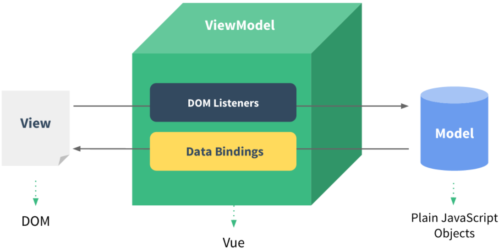

# Part 1 VueJS的MVVM架構設計

VueJS特色如下所示：

* 是一個極輕量級的框架，無需任何樣式或其它庫的需求。
* 引入及初始化之結構簡單容易。
* 可把HTML、CSS、以及JavaScript通通包入一個**元件(Web Component)**中，且元件之間各自獨立，這種把網頁的每一個部份都當成Web Component的概念使得程式重用性大大的提高。
* 預設為View和Model單向綁定，效能提高。(也提供雙向綁定)。



1. ViewModel是Vue.js的核心，它是一個被創建的Vue實體。 Vue實體是作用於某一個HTML元素上的，這個元素可以是HTML的body元素，也可以是指定了id的某個元素。
2. 上圖中的DOM Listeners和Data Bindings看作兩個工具，它們是實現單向或雙向綁定的關鍵。
3. 從View的觀點來看，ViewModel中的DOM Listeners工具會幫我們監測頁面上DOM元素的變化，如果有變化，則更改Model中的數據。
4. 從Model觀點來看，當我們更新Model中的數據時，Data Bindings工具會幫我們更新頁面中的DOM元素。

## 1.1 Vue Instance(View Model)的組成

ViewModel是Vue.js的核心，它負責綁定View(DOM元素)以及Model(JavaScript資料模型)。在VueJS中的ViewModel是一個可以被使用者透過 Vue Constructor (建構式)new出來的Vue實體。所有的Vue app 都開始於Vue實體這個根節點，它具備有哪些初始資料、方法、以及掛載到哪個 DOM ...等等的設定。程式圖如下示之：


上圖中的el屬性用來指定View的部份，也就是指定這個Vue實體(ViewModel)所要作用的View(DOM)之區域。data屬性則是用來指定Model的部份，也就是指定這個Vue實體(ViewModel)所擁有的Model(JavaScript Object)為何。Vue實體(ViewModel)透過這兩個屬性把Html的DOM元素和JavaScript資料模型串接進來，所以VueJS的ViewModel只要有它們就基本能運作了。

## 1.2 資料綁定的模版語法

Vue.js 使用了基於 HTML 的模板語法，允許開發者將 DOM 元素綁定至底層 Vue 實體的資料模型(Model)。所有 Vue.js 的模板都是合法的 HTML ，所以能被遵循規範的瀏覽器和 HTML 解析器解析。Vue 會將模板編譯成虛擬 DOM 作用函數，再結合響應系統，在應用狀態改變時， Vue 能夠聰明的計算出重新作用之組件的最小代價並應用到 DOM 操作上。

### 1.2.1 DOM元素的內文(text)綁定

Vue是採用 **mastache 語法(雙括號)** ，將Span元素的內文(Text)內容和Vue實體中的資料msg做單向的綁定，即資料msg值改變，則Span元素的內文即改變，但反之不成立：
```
<span>Message: {{ msg }}</span>
```
另外透過額外的**v-once**指令，執行一次性地插值，當數據改變時，插值處​​的內容不會更新：
```
<span v-once>Message: {{ msg }}</span>
```
它也支援 JavaScript 表達式且能做些運算：
```
{{ number + 1 }}
{{ ok ? 'YES' : 'NO' }}
{{ message.split('').reverse().join('') }}
```

### 1.2.2 DOM元素的屬性綁定

由於**Mustache語法**不能在 HTML 屬性中使用，因此我們必須利用**v-bind指令**來對DOM元素之屬性做綁定。下行是指把div元素的id屬性和Vue實體中的資料myid做單向綁定，即資料myid值改變會立刻使div元素的id屬性值跟著改變，但反之不成立：
```
<div v-bind:id="myid"></div>
<div v-bind:id="'list-' + myid"></div>
```
這對布林值的DOM元素之屬性也有效，即如果資料值為 false 的話該屬性會被移除，若為true表示此按鈕不能作用，下行表示把Button元素的disabled屬性和Vue實體中的資料isdisable做單向綁定，即資料模型(Model)的值改變，則Button元素的disabled屬性值立刻改變：
```
<button v-bind:disabled="isdisable">Button</button>
```

## 1.3 View和Model之間的單向綁定

在VueJS中，**View(DOM)和Model(JavaScript Object)之間透過ViewModel(Vue實體)實現資料單向綁定**，其***[one-way-databinding.html](./one-way-databinding.html)***範例如下所示：
```
<!DOCTYPE html>
<html>
<head>
    <meta charset="UTF-8">
    <title></title>
</head>
<body>
    <!--簡單的DOM元素(View)-->
    <div id="app">
        <!--把JavaScript Object(Model)的message屬性綁定在<p>這個網頁元素上面-->
        <!--在這裡為單向綁定, 也就是若Model變了View才改變, 反之不成立-->
        <p>{{ message }}</p>
    </div>
</body>
<!--使用引入JS檔的方式來引入Vue.js-->
<script src="https://cdnjs.cloudflare.com/ajax/libs/vue/2.3.4/vue.min.js"></script>
<script>
// 簡單的JavaScript Object(Model)
var exampleData = {
    message: 'Hello World!'
}
// 創建一个 Vue 實體或稱 "ViewModel"
// 它連接 View 与 Model之間的綁定, 此例為單向綁定
var vm = new Vue({
    //指定這個Vue實體(ViewModel)所要作用的View(DOM)之區域為id等於app的區域
    el: '#app',
    //指定這個Vue實體(ViewModel)所擁有的Model(JavaScript Object)
    data: exampleData
    //底下可能有更多的選項參數, 請見new Vue實例API文件
})
</script>
</html>
```
可在Chrome中以Console模式改變Model的值為Hello Vue，可以看到View方面的值也變了，如下圖示：


## 1.4 View和Model之間的雙向綁定

在VueJS中，**View(DOM)和Model(JavaScript Object)之間透過ViewModel(Vue實體)實現資料雙向綁定**，其***[two-way-databinding.html](./two-way-databinding.html)***範例如下所示：
```
<!DOCTYPE html>
<html>
<head>
    <meta charset="UTF-8">
    <title></title>
</head>
<body>
    <!--簡單的DOM元素(View)-->
    <div id="app">
        <!--把JavaScript Object(Model)的message屬性單向綁定在<p>這個網頁元素上面-->
        <p>{{ message }}</p>
        <!--把JavaScript Object(Model)的message屬性, 使用v-model語法來雙向綁定在input網頁元素上-->
        <!--雙向綁定中, 若網頁元素input的值改變則model的message屬性的值也會改變, 反之同理-->
        <input type="text" v-model="message" />
    </div>
</body>
<!--使用引入JS檔的方式來引入Vue.js-->
<script src="https://cdnjs.cloudflare.com/ajax/libs/vue/2.3.4/vue.min.js"></script>
<script>
// 簡單的JavaScript Object(Model)
var exampleData = {
    message: 'Hello World!'
}
// 創建一个 Vue 實體或稱 "ViewModel"
// 它連接 View 与 Model之間的綁定, 此例為雙向綁定
var vm = new Vue({
    //指定這個Vue實體(ViewModel)所要作用的View(DOM)之區域為id等於app的區域
    el: '#app',
    //指定這個Vue實體(ViewModel)所擁有的Model(JavaScript Object)
    data: exampleData
    //底下可能有更多的選項參數, 請見new Vue實例API文件
})
</script>
</html>
```
可在Chrome中以Console模式改變Model資料(message)的值為Hello Vue，可以看到View方面的值也變了，如下圖示：


另可在input中輸入two-way-test後，可以發現input元素之值的改變，也會使得資料(message)值改變為two-way-test，而因為message和DOM元素p之間為單向綁定，因此當資料(message)變動為two-way-test後，則DOM元素p的內文也改變了，其結果如下圖示：


## 1.5 Vue Instance的生命週期

每個 Vue 實體在被創建之前都要經過一系列的初始化過程。例如，實例需要配置數據觀測(data observer)、編譯模版、掛載實例到 DOM ，然後在數據變化時更新 DOM 。在這個過程中，Vue實體也會調用一些如beforeCreate、created、beforeMount、mounted、beforeUpdate、updated、beforeDestroy、以及destroyed等生命週期的方法 ，這就給我們提供了執行自定義邏輯的機會。下列程式碼顯示**beforeCreate**、**created**、**beforeMount**、以及**mounted**之間的差別，完整***[vue-instance-lifecycle.html](./vue-instance-lifecycle.html)***範例如下所示：
```
<!DOCTYPE html>[two-way-databinding.html](./two-way-databinding.html)
<html>
<head>
    <meta charset="UTF-8">
    <title>vue-instance-lifecycle</title>
</head>
<body>
    <!--簡單的DOM元素(View)-->
    <div id="app"></div>
</body>
<!--使用引入JS檔的方式來引入Vue.js-->
<script src="https://cdnjs.cloudflare.com/ajax/libs/vue/2.3.4/vue.min.js"></script>
<script>
// 創建一个 Vue 實體或稱 "ViewModel"
var vm = new Vue({
    //指定這個Vue實體(ViewModel)所要作用的View(DOM)之區域為id等於app的區域
    el: '#app',
    data: {
        beforeCreate: 'before create.',
        created: 'created.',
        beforeMount: 'before mount.',
        mounted: 'mounted.'
    },
    //Vue實體被建立之前
    beforeCreate: function() {
        // `this` 指向new出來的 vm 實體
        alert(this.el + ' ' + this.beforeCreate) //Vue實體被建立之前,el及data全是undefined
        console.log(this.el + ' ' + this.beforeCreate) //Vue實體被建立之前,el及data全是undefined
    },
    //Vue實體被建立之後,data已初始化
    created: function() {
        // `this` 指向new出來的 vm 實體
        alert(this.el + ' ' + this.created) //Vue實體被建立之後,el未形成,data已初始化
        console.log(this.el + ' ' + this.created) //Vue實體被建立之後,el未形成,data已初始化
    },
    //el已和dom元素綁定,且data已初始化
    beforeMount: function() {
        // `this` 指向new出來的 vm 實體
        alert(this.$el + ' ' + this.beforeMount)
        console.log(this.$el + ' ' + this.beforeMount)
    },
    //el已和dom元素綁定,且data已初始化
    mounted: function() {
        // `this` 指向new出來的 vm 實體
        alert(this.$el + ' ' + this.mounted)
        console.log(this.$el + ' ' + this.mounted)
    }
})
</script>
</html>
```