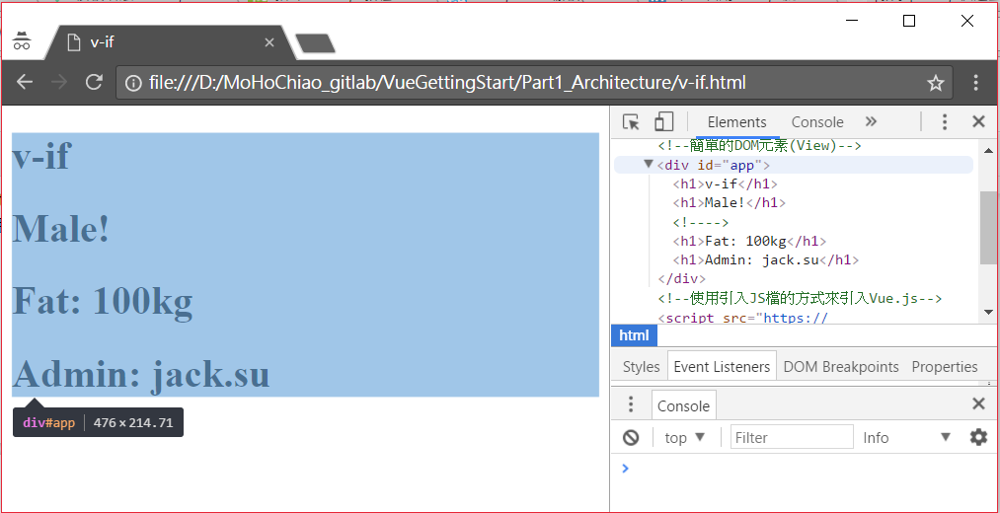
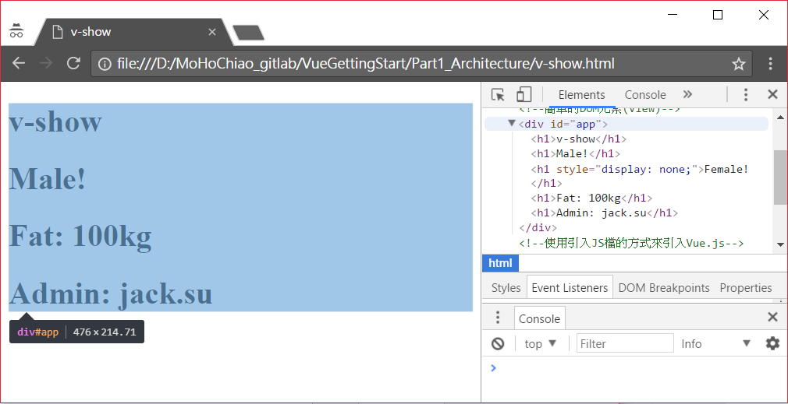
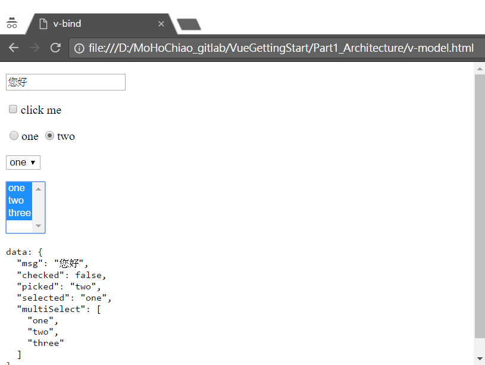
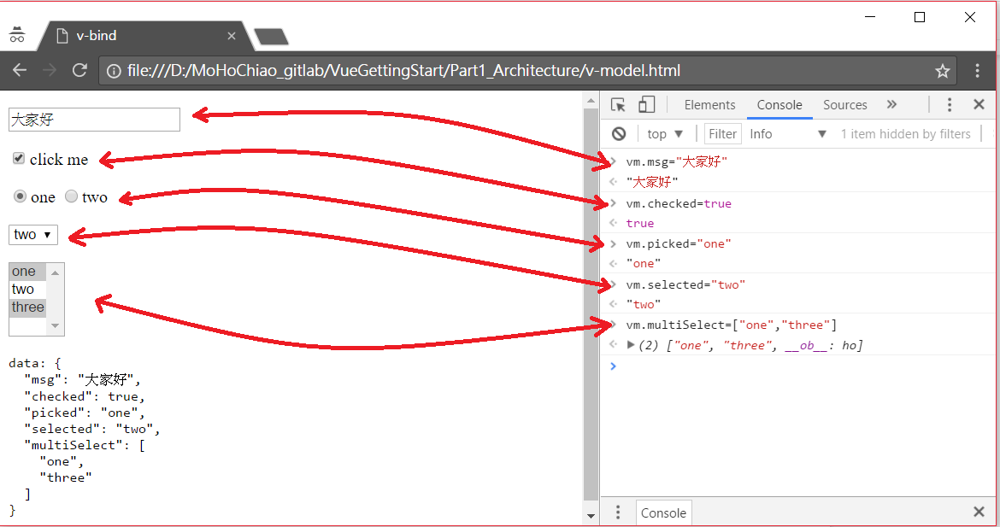

# Part 2 常用內建指令介紹

在VueJS中的內建指令(Directives)是帶有 **v-** 前綴的特殊屬性，指令的職責就是當其表達式的值改變時相應地將某些行為應用到 DOM 上，另外它也提供我們可以自定義指令。

## 2.1 v-text

當資料的值改變時，**v-text指令**的屬性值也會跟著改變，再由此屬性值進而去改變該DOM元素的text content內容。示例如下：
```
<div v-text="message"></div>
```
在上述程式碼中，前綴是默認的 v-，而指令的 ID 是 text，表達式是 message。這個指令告訴 Vue.js， 當 Vue 實體的資料之 message 屬性改變時，更新該 div 元素的 textContent。這樣使用指令綁定元素內文的方式，它其實相當於在2.2.1小節中使用內文(Text)的Mustache 語法來綁定，如下列程式碼：
```
<div>{{ message }}</div>
```
v-text指令的完整***[v-text.html](./v-text.html)***範例如下所示：
```
<!DOCTYPE html>
<html>
<head>
    <meta charset="UTF-8">
    <title>one-way-databinding</title>
</head>
<body>
    <!--簡單的DOM元素(View)-->
    <div id="app">
        <!--把JavaScript Object(Model)的message屬性綁定在<p>這個網頁元素的Text Content屬性上, 在這裡為單向綁定, 也就是若Model變了View才改變, 反之不成立-->
        <!--這個寫法相當於<p>{{ message }}</p>-->
        <p v-text="message"></p>
    </div>
</body>
<!--使用引入JS檔的方式來引入Vue.js-->
<script src="https://cdnjs.cloudflare.com/ajax/libs/vue/2.3.4/vue.min.js"></script>
<script>
// 簡單的JavaScript Object(Model)
var exampleData = {
    message: 'Hello World!'
}

// 創建一个 Vue 實體或稱 "ViewModel"
// 它連接 View 与 Model之間的綁定, 此例為單向綁定
var vm = new Vue({
    //指定這個Vue實體(ViewModel)所要作用的View(DOM)之區域為id等於app的區域
    el: '#app',
    //指定這個Vue實體(ViewModel)所擁有的Model(JavaScript Object)
    data: exampleData
    //底下可能有更多的選項參數, 請見new Vue實例API文件
})
</script>
</html>
```

## 2.2 v-if

**v-if**是條件成立才可以作用的指令，它根據其屬性值中的表達式之真假來刪除和插入DOM元素，它的基本語法如下：
```
v-if="expression"
```
上行中的expression是一個返回bool值的表達式，表達式可以是一個bool屬性，也可以是一個返回bool的運算式。完整***[v-if.html](./v-if.html)***範例如下所示：
```
<!DOCTYPE html>
<html>
<head>
    <meta charset="UTF-8">
    <title>v-if</title>
</head>
<body>
    <!--簡單的DOM元素(View)-->
    <div id="app">
        <h1>v-if</h1>
        <h1 v-if="isMale">Male!</h1>
        <h1 v-if="isFemale">Female!</h1>
        <h1 v-if="kg >= 100">Fat: {{ kg }}kg</h1>
        <h1 v-if="account.indexOf('jack') >= 0">Admin: {{ account }}</h1>
    </div>
</body>
<!--使用引入JS檔的方式來引入Vue.js-->
<script src="https://cdnjs.cloudflare.com/ajax/libs/vue/2.3.4/vue.min.js"></script>
<script>
// 創建一个 Vue 實體或稱 "ViewModel"
var vm = new Vue({
    //指定這個Vue實體(ViewModel)所要作用的View(DOM)之區域為id等於app的區域
    el: '#app',
    //指定這個Vue實體(ViewModel)所擁有的Model(JavaScript Object)
    data: {
        isMale: true,
        isFemale: false,
        kg: 100,
        account: 'jack.su'
    }
})
</script>
</html>
```

使用Chrome的Console Mode可以看到，只要**v-if**值為false(此例為isFemale)就不會看到該DOM元素出現在網頁中，圖示如下：



## 2.3 v-show

**v-show**也是條件成立才可以作用的指令，但是它不論表達式之值為真或為假，皆會插入DOM元素，判斷值若為true則顯示此DOM元素，若為false幫此DOM元素加上CSS屬性**display:none**來讓它不顯示出來，完整***[v-show.html](./v-show.html)***範例如下所示：
```
<!DOCTYPE html>
<html>
<head>
    <meta charset="UTF-8">
    <title>v-show</title>
</head>
<body>
    <!--簡單的DOM元素(View)-->
    <div id="app">
        <h1>v-show</h1>
        <h1 v-show="isMale">Male!</h1>
        <h1 v-show="isFemale">Female!</h1>
        <h1 v-show="kg >= 100">Fat: {{ kg }}kg</h1>
        <h1 v-show="account.indexOf('jack') >= 0">Admin: {{ account }}</h1>
    </div>
</body>
<!--使用引入JS檔的方式來引入Vue.js-->
<script src="https://cdnjs.cloudflare.com/ajax/libs/vue/2.3.4/vue.min.js"></script>
<script>
// 創建一个 Vue 實體或稱 "ViewModel"
var vm = new Vue({
    //指定這個Vue實體(ViewModel)所要作用的View(DOM)之區域為id等於app的區域
    el: '#app',
    //指定這個Vue實體(ViewModel)所擁有的Model(JavaScript Object)
    data: {
        isMale: true,
        isFemale: false,
        kg: 100,
        account: 'jack.su'
    }
})
</script>
</html>
```
使用Chrome的Console Mode可以看到，**v-show**值為false(此例為isFemale)的DOM元素仍會出現在網頁中，不過該DOM元素多了CSS屬性**display:none**，圖示如下：



## 2.4 v-else

**v-else**指令必須是和3.2節的**v-if**以及3.3節的**v-show**一起成對使用的。同時，**v-else**元素必須立即跟在**v-if**或**v-show**元素的後面，**v-else**和**v-if**有相同特性，不論搭配的是**v-if**或**v-show**都是根據條件是否成立來決定要不要在網頁上插入這個DOM元素。完整***[v-else.html](./v-else.html)***範例如下所示：
```
<!DOCTYPE html>
<html>
<head>
    <meta charset="UTF-8">
    <title>v-else</title>
</head>
<body>
    <!--簡單的DOM元素(View)-->
    <div id="app">
        <h1 v-if="age >= 30">You are too old.</h1>
        <h1 v-else>You are too young.</h1>
        <h1>---------------------分割线---------------------</h1>
        <h1 v-show="sex == 'Male'">You are a man.</h1>
        <h1 v-else>You are a woman.</h1>
    </div>
</body>
<!--使用引入JS檔的方式來引入Vue.js-->
<script src="https://cdnjs.cloudflare.com/ajax/libs/vue/2.3.4/vue.min.js"></script>
<script>
// 創建一个 Vue 實體或稱 "ViewModel"
var vm = new Vue({
    //指定這個Vue實體(ViewModel)所要作用的View(DOM)之區域為id等於app的區域
    el: '#app',
    //指定這個Vue實體(ViewModel)所擁有的Model(JavaScript Object)
    data: {
        age: 28,
        sex: 'Male'
    }
})
</script>
</html>
```

## 2.5 v-else-if

**v-else-if**指令和3.4節的**v-else**指令的特性完全相同。完整***[v-else-if.html](./v-else-if.html)***範例如下所示：
```
<!DOCTYPE html>
<html>
<head>
    <meta charset="UTF-8">
    <title>v-else-if</title>
</head>
<body>
    <!--簡單的DOM元素(View)-->
    <div id="app">
        <h1>{{ score }}分</h1>
        <div v-show="isShow">
            <p v-if="score >= 7 && score <=10">Vue.js so easy</p>
            <p v-else-if="score >= 3 && score <= 6">still learning Vue.js</p>
            <p v-else-if="score >= 0 && score <= 2">Vue.js so hard</p>
            <p v-else>score is illegal</p>
        </div>
        <p>你覺得vue.js簡單嗎？請輸入1~10分</p>
        <input type="text" v-model="score">
    </div>
</body>
<!--使用引入JS檔的方式來引入Vue.js-->
<script src="https://cdnjs.cloudflare.com/ajax/libs/vue/2.3.4/vue.min.js"></script>
<script>
// 創建一个 Vue 實體或稱 "ViewModel"
var vm = new Vue({
    el: '#app',
    data: {
        isShow: true,
        score: '0'
    }
});
</script>
</html>
```

## 2.6 v-for

**v-for** 指令即一般常見的 for 迴圈，處理JavaScript陣列物件中的數據組。完整***[v-for.html](./v-for.html)***範例如下所示：
```
<!DOCTYPE html>
<html>
<head>
    <meta charset="UTF-8">
    <title>v-for</title>
</head>
<body>
    <!--簡單的DOM元素(View)-->
    <div id="app">
        <table border="1">
            <thead>
                <tr>
                    <th>Name</th>
                    <th>info</th>
                    <th>Sex</th>
                </tr>
            </thead>
            <tbody>
                <tr v-for="(person,index) in people">
                    <td>{{ index + '. ' + person.name }}</td>
                    <td>{{ person.info }}</td>
                    <td>{{ person.sex }}</td>
                </tr>
            </tbody>
        </table>
    </div>
</body>
<!--使用引入JS檔的方式來引入Vue.js-->
<script src="https://cdnjs.cloudflare.com/ajax/libs/vue/2.3.4/vue.min.js"></script>
<script>
// 創建一个 Vue 實體或稱 "ViewModel"
var vm = new Vue({
    //指定這個Vue實體(ViewModel)所要作用的View(DOM)之區域為id等於app的區域
    el: '#app',
    //指定這個Vue實體(ViewModel)所擁有的Model(JavaScript Object)
    data: {
        people: [{
            name: 'Leo',
            info: '碼農',
            sex: 'Male'
        }, {
            name: 'Troy',
            info: '資深碼農',
            sex: 'Male'
        }, {
            name: 'Michael',
            info: '資深碼農',
            sex: 'Male'
        }, {
            name: 'Linda',
            info: '碼農管理者',
            sex: 'FeMale'
        }]
    }
})
</script>
</html>
```

## 2.7 v-bind

**v-bind**指令可以在其名稱後面帶一個參數，中間放一個冒號隔開，這個參數通常是HTML元素的特性（attribute），因此最常用來對DOM元素之屬性做綁定。例如：**v-bind:class**、**v-bind:id**、**v-bind:style**、**v-bind:disabled**、**v-bind:href**...等等。完整***[v-bind.html](./v-bind.html)***範例如下所示：
```
<!DOCTYPE html>
<html>
<head>
    <meta charset="UTF-8">
    <title>v-bind</title>
    <!--簡單的CSS設定-->
    <style>
    .big {
        color: blue;
        background-color: white;
    }
    .small {
        color: lightblue;
        background-color: black;
    }
    </style>
</head>
<body>
    <div id="app">
        <!--使用v-bind將這個div元素的style屬性和資料模型作綁定-->
        <div v-bind:style="{ color: myColor, fontSize: myFontSize + 'px' }">123</div>
        <!--使用v-bind將這個div元素的style屬性和資料模型作綁定-->
        <div v-bind:style="myStyle">456</div>
        <!--使用v-bind將所有產生出來的span元素之class屬性和資料模型作綁定-->
        <span v-for="n in pageCount" v-bind:class="(n%2) === 0 ? 'big' : 'small'">{{ n }}</span>
    </div>
</body>
<!--使用引入JS檔的方式來引入Vue.js-->
<script src="https://cdnjs.cloudflare.com/ajax/libs/vue/2.3.4/vue.min.js"></script>
<script>
// 創建一个 Vue 實體或稱 "ViewModel"
new Vue({
    //指定這個Vue實體(ViewModel)所要作用的View(DOM)之區域為id等於app的區域
    el: '#app',
    //指定這個Vue實體(ViewModel)所擁有的Model(JavaScript Object)
    data: {
        myColor: 'red',
        myFontSize: 30,
        myStyle: {
            color: 'green',
            fontSize: '50px'
        },
        pageCount: 10,
        activeNumber: 1
    }
});
</script>
</html>
```

**v-bind**指令因為很常用到，因此VueJS提供縮寫為**冒號**，例如：**:class**、**:id**、**:style**、**:disabled**、**:href**...等等。

## 2.8 v-on

**v-on**指令用於監聽DOM事件，例如元素的滑鼠點擊事件以及鍵盤敲擊事件如下：
```
<a v-on:click="doSomething">Do</a>
<button v-on:click="doSomething">Do</button>
<input type="submit" value="Do" v-on:click="doSomething">
<input v-on:keyup="doSomething">
```
上述中的doSomething可以是一個方法或是合法的Javascript表達示。

**v-on:click**有五種事件修饰符號，如**stop**、**prevent**、**capture**、**self**、**once**，如下：
```
<!-- 阻止單擊事件觸發 -->
<a v-on:click.stop="doThis"></a>
<!-- 提交事件不再重載頁面 -->
<form v-on:submit.prevent="onSubmit"></form>
<!-- 修飾符號之間可以串聯, 下列為 阻止點擊事件觸發 + 不再重載頁面 -->
<a v-on:click.stop.prevent="doThat"></a>
<!-- 可以只有修飾符 -->
<form v-on:submit.prevent></form>
<!-- 添加事件偵聽器時使用事件捕獲模式 -->
<div v-on:click.capture="doThis">...</div>
<!-- 只當事件在該元素本身（而不是子元素）觸發時觸發 -->
<div v-on:click.self="doThat">...</div>
<!-- 點擊事件將只會被觸發一次 -->
<a v-on:click.once="doThis"></a>
```
**v-on:click**也有許多鍵盤鍵值修饰符號，這些符號也可以利用自定義的方式來新增。內建的符號如**enter**、**tab**、**delete**、**esc**、**space**、**up**、**down**、**left**、**right**、**ctrl**、**alt**、**shift**、**meta**，例如**enter**語法如下：
```
<!-- 只有在 keyCode 是 13 時調用 vm.submit() -->
<input v-on:keyup.enter="submit">
```
我們利用**v-on:click**及**v-on:key**指令來做一個簡單的計數器，利用點擊事件作加減法以及鍵盤事件作設定值，完整***[v-on.html](./v-on.html)***範例如下所示：
```
<!DOCTYPE html>
<html>
<head>
    <meta charset="UTF-8">
    <title>v-on</title>
</head>
<body>
    <!--簡單的DOM元素(View)-->
    <div id="app">
        <!--把這個p元素和資料count單向綁定在一起-->
        <p>{{ count }}</p>
        <!--click事件直接绑定一个方法-->
        <p>
            <a href="javascripit:void(0)" v-on:click="add">add</a>
        </p>
        <!--click事件直接绑定一个方法-->
        <p>
            <button v-on:click="sub">sub</button>
        </p>
        <p>
            <input type="number" v-on:keyup.enter="set('Come from input element!', $event)">
        </p>
    </div>
</body>
<!--使用引入JS檔的方式來引入Vue.js-->
<script src="https://cdnjs.cloudflare.com/ajax/libs/vue/2.3.4/vue.min.js"></script>
<script>
// 創建一个 Vue 實體或稱 "ViewModel"
var vm = new Vue({
    //指定這個Vue實體(ViewModel)所要作用的View(DOM)之區域為id等於app的區域
    el: '#app',
    //指定這個Vue實體(ViewModel)所擁有的Model(JavaScript Object)
    data: {
        count: 0
    },
    //指定這個Vue實體(ViewModel)所擁有的Method(JavaScript function)
    methods: {
        //元素預設會傳送點擊的事件過來
        add: function(event) {
            alert(event.target.tagName)
            //方法内 `this` 指向 vm
            this.count++
        },
        //元素預設會傳送點擊的事件過來
        sub: function(event) {
            alert(event.target.tagName)
            //方法内 `this` 指向 vm
            this.count--
        },
        //元素傳送Alert的訊息以及點擊的事件過來
        set: function(msg, event) {
            alert(msg)
            //方法内 `this` 指向 vm
            this.count = event.target.value
        }
    }
})
</script>
</html>
```
**v-on**指令因為很常用到，因此VueJS提供縮寫為**@**，例如：**@click**、**@key**等等。

## 2.9 v-model

你可以在任何表單的元素上使用 **v-model** 指令來創建雙向資料綁定(VueJS的預設行為是單向綁定，也就是View的改變不主動影響到Model)。它會根據表單元素的類型自動選取正確的綁定模式。完整***[v-model.html](./v-model.html)***範例如下所示：
```
<!DOCTYPE html>
<html>
<head>
    <meta charset="UTF-8">
    <title>v-bind</title>
</head>
<body>
    <!--簡單的DOM元素(View)-->
    <form id="v-model-demo">
        <!-- text input雙向綁定資料msg -->
        <p><input type="text" v-model="msg"></p>
        <!-- checkbox input雙向綁定資料checked -->
        <p><input type="checkbox" v-model="checked">click me</p>
        <!-- radio buttons雙向綁定資料picked -->
        <p>
            <input type="radio" name="picked" value="one" v-model="picked">one
            <input type="radio" name="picked" value="two" v-model="picked">two
        </p>
        <!-- select雙向綁定資料selected -->
        <p>
            <select v-model="selected">
                <option>one</option>
                <option>two</option>
            </select>
        </p>
        <!-- multiple select雙向綁定資料multiSelect -->
        <p>
            <select v-model="multiSelect" multiple>
                <option>one</option>
                <option>two</option>
                <option>three</option>
            </select>
        </p>
        <!--這裡使用json過濾器(Filter)來方便顯示Vue實體中的資料模型data之追踪-->
        <p><pre>data: {{$data | json 2}}</pre></p>
    </form>
</body>
<!--使用引入JS檔的方式來引入Vue.js-->
<script src="https://cdnjs.cloudflare.com/ajax/libs/vue/2.3.4/vue.min.js"></script>
<script>
// 創建一个 Vue 實體或稱 "ViewModel"
var vm = new Vue({

    //指定這個Vue實體(ViewModel)所要作用的View(DOM)之區域為id等於v-model-demo的區域
    el: '#v-model-demo',
    //指定這個Vue實體(ViewModel)所擁有的Model(JavaScript Object)
    data: {
        msg: 'hi!',
        checked: true,
        picked: 'one',
        selected: 'two',
        multiSelect: ['one', 'three']
    }
})
</script>
</html>
```
我們這裡會使用VueJS的Filter功能來方便觀察資料模型的數據變化，把Vue實體的資料模型以JSON的型式輸出，其語法如下：
```
{{$data | json 2}}
```
我們在瀏覽器中的各種表單元素操作都會立刻反應在Vue實體的資料模型上，也就是View的改變也自動改變了Model，如下圖所示：



在Chrome中打開Console模式，改變Vue實體的資料模型之各種數據，可以很明顯的發現資料模型的數據改變也會自動使各個表單元素作出改變，即Model的改奱也自動改變了View，如下圖示之：


