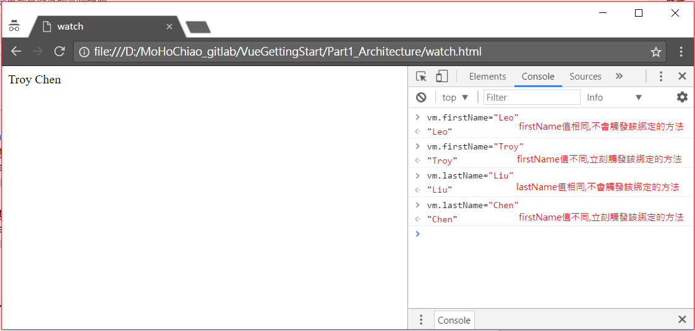

# Part 3 Watch-監看資料屬性的異動

我們有時也會需要監視資料屬性值是否有變化，**如果資料屬性值有變化才去呼叫相應的方法以做出應對，如果沒有變化則不需要執行任何應對的方法**。在Vue實體中使用**Watch**可以幫助我們達到這項需求。完整***[watch.html](./watch.html)***範例如下所示：
```
<!DOCTYPE html>
<html>
<head>
    <meta charset="UTF-8">
    <title>watch</title>
</head>
<body>
    <!--簡單的DOM元素(View)-->
    <div id="app">{{ fullName }}</div>
</body>
<!--使用引入JS檔的方式來引入Vue.js-->
<script src="https://cdnjs.cloudflare.com/ajax/libs/vue/2.3.4/vue.min.js"></script>
<script>
// 創建一个 Vue 實體或稱 "ViewModel"
var vm = new Vue({
    el: '#app',
    data: {
        firstName: 'Leo',
        lastName: 'Liu',
        fullName: 'Leo Liu'
    },
    //指定這個Vue實體(ViewModel)所要監看的資料屬性以及資料屬性值改變後所要應對的方法
    //應對的方法會自動傳入改變後的新資料屬性值
    watch: {
        firstName: function(newValue) {
            alert("first name change to " + newValue)
            this.fullName = newValue + ' ' + this.lastName
        },
        lastName: function(newValue) {
            alert("last name change to " + newValue)
            this.fullName = this.firstName + ' ' + newValue
        }
    }
})
</script>
</html>
```
下圖為Chrome的Console模式下動態改變firstName及lastName的值。由於firstName初始值為Leo，因此如果再設定firstName值為Leo則相應的方法不可能再次被觸動，反之，若把firstName值改為Troy的話，會立刻觸發相應的方法。同理，lastName值也是一樣的道理。圖示如下所示：

