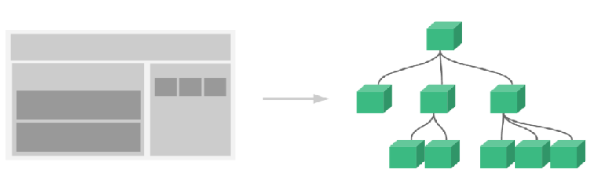
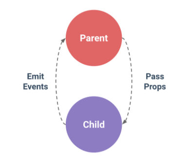

# Part 6 Web Component(組件元素)

**組件（Component）**是 Vue.js 最強大的功能之一。組件可以擴展 HTML 元素，封裝可重用的代碼。在較高層面上，組件是自定義元素， Vue.js 的編譯器為它添加特殊功能。如下圖所示。



原本網頁上的各種元素都被當成一個接一個的組件，父組件當中還可以包括子組件，且組件和組件之間也能相互的溝通。我們在2.1節中介紹的**Vue實體其實就可以視為一個組件**，**它是所有其下組件的根組件**，**Vue實體和單純組件最大的差別在於組件沒有el屬性以及其datag屬性必需是一個函數**。在真實的應用中，通常Vue實體只會有一個，可是卻會存在著很多的元件(Component)。

## 6.1 組件的創建過程

Vue.js的組件的使用有3個步驟：創建組件、註冊組件和使用組件：

1. 創建組件構造器：```var myComponent = Vue.extend({...})```

2. 註冊組件：```Vue.component('my-component', myComponent)```

3. 使用組件：```<my-component></my-component>```

由第三點使用組件可以看到，這根本就是在自定義一個HTML標籤，而**這個自定義標籤的內容(HTML、CSS、JavaScript)就隱藏在組件的模版(Template)屬性中**，完整***[create-component.html](./create-component.html)***範例如下所示：
```
<!DOCTYPE html>
<html>
<body>
    <!--簡單的DOM元素(View)-->
    <div id="app">
        <!-- 3. #app是Vue實體所能作用的區域,組件一定要在Vue實體作用範圍內使用-->
        <my-component></my-component>
    </div>
    <!--瀏覽器也不會出錯,但因為組件不在Vue實體所能作用的區域,所以這一行一點用處都沒有-->
    <my-component></my-component>
</body>
<!--使用引入JS檔的方式來引入Vue.js-->
<script src="https://cdnjs.cloudflare.com/ajax/libs/vue/2.3.4/vue.min.js"></script>
<script>
// 1.創建一個新的組件
var myComponent = Vue.extend({
    //宣告這個組件的內容(HTML,CSS,JavaScript),或稱模版(Template)
    template: '<div>This is my first component!</div>'
})
// 2.註冊組件(全域註冊)，並指定組件的標籤，組件的HTML標籤為<my-component>
Vue.component('my-component', myComponent)
// 創建一个 Vue 實體或稱 "ViewModel"
new Vue({
    //指定這個Vue實體(ViewModel)所要作用的View(DOM)之區域為id等於app的區域
    el: '#app'
})
</script>
</html>
```
特別注意的是**每一個組件的template中只能有一個根節點**，這是在Vue2.0以後修改的，也就是你不能這樣寫：

```template: '<div>This is my first root!</div><div>This is my second root!</div>'```

上述的寫法，網頁不會出錯，但永遠只會顯示第一個根節點在網頁上，即This is my first root!，第二個根節點及其之後的所有內容不會被處理，因此應該改成把兩個div元素包起來變成只有一個根節點，其作法如下：

```template: '<div><div>This is my first root!</div><div>This is my second root!</div></div>'```

## 6.2 組件的全域註冊和私域註冊

組件被全域註冊表示不論那一個Vue實體所作用的區域都可以使用這個組件，只要組件在某個Vue實體作用的區域就有效。私域註冊表示只把組件註冊在某一個Vue實體(或父組失)上，因此只有在這個Vue實體(或父組件)所作用的區域中，該組件才能被使用。

組件的全域註冊語法：```Vue.component('my-component', myComponent)```

組件的私域註冊語法：
```
new Vue({
    // ...
    components: {
        //註冊在某一個Vue實體上,因此<my-component>只能在這個實體的作用區域內使用
        'my-component': Child
    }
})
```
```
var parentComponent = Vue.extend({
    // ...
    components: {
        //註冊在某一個父組件上,因此<my-child-component>只能在這個組件的作用區域內使用
        'my-child-component': Child
    }
})
```
完整***[register-component.html](./register-component.html)***範例如下所示：
```
<!DOCTYPE html>
<html>
<head>
    <meta charset="UTF-8">
    <title>register-component</title>
</head>
<body>
    <!--<my-component1>是全域註冊的方式,所以不論在在app1及app2都可以作用-->
    <!--<my-component2>是私域註冊在vm2的方式,所以只有在app2可以作用-->
    <!--<my-component3>是私域註冊在vm2的方式,所以只有在app2可以作用-->
    <div id="app1">
        <my-component1></my-component1>
        <my-component2></my-component2>
        <my-component3></my-component3>
    </div>
    ---------------app1和ap2的分割线---------------
    <div id="app2">
        <my-component1></my-component1>
        <my-component2></my-component2>
        <my-component3></my-component3>
    </div>
</body>
<!--使用引入JS檔的方式來引入Vue.js-->
<script src="https://cdnjs.cloudflare.com/ajax/libs/vue/2.3.4/vue.min.js"></script>
<script>
//創建一個新的組件
var myComponent = Vue.extend({
    //宣告這個組件的內容(HTML,CSS,JavaScript),或稱模版(Template)
    template: '<div>This is the first component!</div>'
})
//全域註冊my-component1,所有的Vue實體都可以使用此組件
Vue.component('my-component1', myComponent)
// 創建一个 Vue 實體或稱 "ViewModel"
var vm1 = new Vue({
    //指定這個Vue實體(ViewModel)所要作用的View(DOM)之區域為id等於app1的區域
    el: '#app1'
})
// 創建一个 Vue 實體或稱 "ViewModel"
var vm2 = new Vue({
    //指定這個Vue實體(ViewModel)所要作用的View(DOM)之區域為id等於app2的區域
    el: '#app2',
    components: {
        //私域註冊my-component2在vm2上,因此只有這個Vue實體所能作用的區域才可以使用此組件
        'my-component2': {
            template: '<div>This is the second component!</div>'
        },
        //私域註冊my-component3在vm2上,因此只有這個Vue實體所能作用的區域才可以使用此組件
        'my-component3': {
            template: '<div>This is the third component!</div>'
        }
    }
})
</script>
</html>
```

## 6.3 創建及註冊組件的另一種語法

在7.1節中，我們是先把組件創建出來，然後再去註冊這個組件：
```
var myComponent = Vue.extend({...})    //先創建一個組件
Vue.component('my-component', myComponent)    //再註冊這個組件
```
但是其實它們是可以寫在一起的，不過這是適用於**"當你的組件之template較為簡單時”**所用的方式，在一般情況下為了維護方便，還是應該分開來宣告比較清楚。

創建組件及全域註冊：
```
// 全域註冊，my-component1是標籤名稱
Vue.component('my-component1',{
    template: '<div>This is the first component!</div>'
})
var vm1 = new Vue({
    el: '#app1'
})
```
```
創建組件及私域註冊：
var vm2 = new Vue({
    el: '#app2',
    components: {
        // 私域註冊，my-component2是標籤名稱
        'my-component2': {
            template: '<div>This is the second component!</div>'
        },
        // 私域註冊，my-component3是標籤名稱
        'my-component3': {
            template: '<div>This is the third component!</div>'
        }
    }
})
```

## 6.4 組件中的資料模型(Model)

創建組件和創建Vue實體一樣，我們可以宣告它的資料模型(JavaScript Object Model)。但差別在於，**在Vue實體中的資料模型是一個稱為Data的屬性**，它可以存放JavaScript Object作為值，如下所示：
```
var vm = new Vue({
    el: '#app',
    //指定這個Vue實體(ViewModel)所擁有的Model(JavaScript Object)
    data: {
        message: 'hello'
    }
})
```
然而，**在組件中的Data必須是一個函數**。如下所示：
```
Vue.component('my-component', {
    template: '<div>This is my component</div>'
    //組件中的data必須是一個函數
    data: function(){
        return {a : 1}
    }
})
```
完整***[data-component.html](./data-component.html)***範例如下所示：
```
<!DOCTYPE html>
<html>
<head>
    <meta charset="UTF-8">
    <title>data-component</title>
</head>
<body>
    <!--組件<menu-section>為全域註冊,因此不論那個Vue實體所作用的區域皆可作用-->
    <!--組件<description-section>為私域註冊在app1底下,因此只有在app1實體所作用的區域才可作用-->
    <div id="app1">
        {{ message1 }}
        <menu-section></menu-section>
        <description-section></description-section>
    </div>
    ---------------app1和ap2的分割线---------------
    <div id="app2">
        {{ message2 }}
        <menu-section></menu-section>
        <description-section></description-section>
    </div>
</body>
<!--使用引入JS檔的方式來引入Vue.js-->
<script src="https://cdnjs.cloudflare.com/ajax/libs/vue/2.3.4/vue.min.js"></script>
<script>
//創建且全域註冊一個名為menu-section的組件
Vue.component('menu-section', {
    //可以把template想像成一群HTML元素的集合
    //在這個template中用到組件自己的data,即menuItems
    template: '<ul><li v-for="item in menuItems">{{ item.text }}</li></ul>',
    //組件的data必須是一個函數
    data: function() {
        return {
            menuItems: [{
                text: 'About me'
            }, {
                text: 'Articles'
            }, {
                text: 'contact'
            }]
        };
    }
})
// 創建一个 Vue 實體或稱 "ViewModel"
var app1 = new Vue({
    //指定這個Vue實體(ViewModel)所要作用的View(DOM)之區域為id等於app1的區域
    el: '#app1',
    //指定這個Vue實體(ViewModel)所擁有的Model(JavaScript Object)
    data: {
        message1: 'This is APP 1'
    },
    //指定這個Vue實體(ViewModel)所擁有的組件之集合
    components: {
        //創建且私域註冊一個名為description-section的組件
        'description-section': {
            //可以把template想像成一群HTML元素的集合
            //在這個template中用到組件自己的data,即text
            template: '<p>{{ text }}</p>',
            //組件的data必須是一個函數
            data: function() {
                return {
                    text: 'This is description-section.'
                }
            }
        }
    }
})
// 創建一个 Vue 實體或稱 "ViewModel"
var app2 = new Vue({
    //指定這個Vue實體(ViewModel)所要作用的View(DOM)之區域為id等於app2的區域
    el: '#app2',
    //指定這個Vue實體(ViewModel)所擁有的Model(JavaScript Object)
    data: {
        message2: 'This is APP 2'
    }
})
</script>
</html>
```

## 6.5 父組件與子組件

簡單來說，就是組件裡面還可以再包含另一個組件，其實如果把Vue實體也看成組件(事實上它們很像)，那麼就可以把依附在Vue實體中的組件稱之為它的子組件，在上面的章節範例中已經看過不少這樣的例子。**在某個父組件中要包括子組件**，**其實就是利用父組件的component屬性把子組件私域註冊在父組件之下就可以了**，一切如同7.2節所示。我們將展示一個父組件下面具有兩個子組件，完整***[basic-child-parent-component_1.html](./basic-child-parent-component_1.html)***範例如下所示：
```
<!DOCTYPE html>
<html>
<body>
    <div id="app">
        <parent-component></parent-component>
    </div>
</body>
<!--使用引入JS檔的方式來引入Vue.js-->
<script src="https://cdnjs.cloudflare.com/ajax/libs/vue/2.3.4/vue.min.js"></script>
<script>
//創建一個Child組件
var Child1 = Vue.extend({
    template: '<p>This is a child1 component!</p>'
})
//創建一個Child組件
var Child2 = Vue.extend({
    template: '<p>This is a child2 component!</p>'
})
//創建一個Parent組件
var Parent = Vue.extend({
    /* 
    	在Parent組件內使用<child-component>標籤
    	特別注意的是在Vue2.0後,一個組件中的template只能有一個根節點,因此需要在最外層再包一層div元素,使其只有一個根節點
    	若組件中的template有多個根節點,網頁雖然不會出錯,但永遠只有第一個根節點的內容被Vue.js作處理
    */
    template: '<div>' +
        		'<p>This is a parent component!</p>' +
        		'<child1-component></child1-component>' +
        		'<child2-component></child2-component>' +
        	  '</div>',
    components: {
        //私域註冊兩個Child組件為此父組件的子組件,因為私域,所以該組件只能在Parent組件內使用
        'child1-component': Child1,
        'child2-component': Child2
    }        
})
// 全域註冊Parent組件
Vue.component('parent-component', Parent)
// 創建一个 Vue 實體或稱 "ViewModel"
new Vue({       
    el: '#app'      
})
</script>
</html>
```
由上述範例程式可以發現一點，當組件的template內容非常複雜時，這種用字串都兜起來的內容實在很難維護，因此其中一種VueJS標準的作法是把template內容抽取出來獨立撰寫在標籤之中，在VueJS2.0以後，其所用的標籤如下：

```<script type="text/x-template" id="my-template"></script>```

只要把template的內容寫在上述標籤之中即可，記得給一個id，這樣組件在捉取template才知道要捉取那一段標籤的內容。將上述的程式不論組件的template內容是否複雜，皆抽取出來撰寫的完整***[basic-child-parent-component_2.html](./basic-child-parent-component_2.html)***範例如下所示：
```
<!DOCTYPE html>
<html>
<body>
    <div id="app">
        <parent-component></parent-component>
    </div>
</body>
<!--使用引入JS檔的方式來引入Vue.js-->
<script src="https://cdnjs.cloudflare.com/ajax/libs/vue/2.3.4/vue.min.js"></script>
<!--父組件的template內容,記得每一個組件的template只能有一個根元素-->
<script type="text/x-template" id="parent-template">
    <div>
        <p>This is a parent component!</p>
        <!--在Parent組件內使用<child1-component>標籤-->
        <child1-component></child1-component>
        <!--在Parent組件內使用<child2-component>標籤-->
        <child2-component></child2-component>
    </div>
</script>
<!--子組件1的template內容,記得每一個組件的template只能有一個根元素-->
<script type="text/x-template" id="child1-template">
    <p>This is a child1 component!</p>
</script>
<!--子組件2的template內容,記得每一個組件的template只能有一個根元素-->
<script type="text/x-template" id="child2-template">
    <p>This is a child2 component!</p>
</script>
<script>
//創建一個Child組件
var Child1 = Vue.extend({
    template: '#child1-template'
})
//創建一個Child組件
var Child2 = Vue.extend({
    template: '#child2-template'
})
//創建一個Parent組件
var Parent = Vue.extend({
    template: '#parent-template',
    components: {
        //私域註冊兩個Child組件為此父組件的子組件,因為私域,所以該組件只能在Parent組件內使用
        'child1-component': Child1,
        'child2-component': Child2
    }        
})
// 全域註冊Parent組件
Vue.component('parent-component', Parent)
// 創建一个 Vue 實體或稱 "ViewModel"
new Vue({       
    el: '#app'      
})
</script>
</html>
```
上述程式碼中，可以看到我們把每個組件的template抽取出來獨自撰寫，這樣使得每一個組件中的template可以簡化只需要填入標籤之id即可，這樣可以**使得HTML代碼和JavaScript代碼是分離的**，**大大的增加程式的可維護性**。但是如果組件繁多，且每一個組件的內容都很龐大，然後組件之間的關係又極為複雜，這樣的寫法仍然會很難維護，**因此最好的方式應該是把每一個組件都獨立成一個檔案(.Vue檔)來分門別類的管理**，**而且最重要的是這樣組件才具有可重複使用性**。

## 6.6 父組件與子組件之間的溝通方式

多個組件意味著可以協同工作，通常父子組件會是這樣的關係，某組件 A 在它的模版中使用了組件 B 。它們之間必然需要相互通信：父組件要給子組件傳遞數據，子組件需要將它內部發生的事情告知給父組件。然而，在一個良好定義的接口中盡可能將父子組件解耦是很重要的。這保證了每個組件可以在相對隔離的環境中書寫和理解，也大幅提高了組件的可維護性和可重用性。在 Vue.js 中，**父子組件的溝通可以總結為 props down, events up **。**父組件通過子組件的props屬性向下傳遞參數給子組件**，**而子組件則通過 Emit events(自定義事件) 給父組件發送消息**。如下圖示：



### 6.6.1 porps屬性

在7.4節中，我們介紹過組件的data屬性，它必須是一個函數。每一個組件都應該是獨立的存在，而不是去引用或改變其它組件的資料，因此組件都應具有**data屬性來表示組件自己的內部狀態**，但同時它又需要具備讓外界(其它組件)與它溝通的能力，因此有了**props屬性作為組件本身跟外界溝通的介面**，所有外界的資料我們都可以經由該組件的props屬性來傳入：
```
Vue.component('child', {
   //宣告 props 屬性來作為對外的接口
   props: ['myMessage'],
   // 就像 data 一樣，prop 可以用在組件自己的模板內
   // 同樣也可以在 vm 實例中像 "this.myMessage" 這樣使用
   template: '<span>{{ myMessage }}</span>'
})
```
然後在引用此組件時，我們可以如下向它傳入一個普通字串當成該prop的參數：

```<child my-message="hello!"></child>```

這裡要特別注意的是HTML 特性是不區分大小寫的，因此當你在JavaScript中使用camelCased式命名的變數(Data屬性或Propg屬性)時，需要自己記得轉成kebab-case式的命名，例如上面程式的props屬性中，有一個命名為myMessage的prop，則在HTML引用這個屬性時，要將它改成my-message。完整***[props-component.html](./props-component.html)***範例如下所示：
```
<!DOCTYPE html>
<html>
<head>
    <meta charset="UTF-8">
    <title>props-component</title>
</head>
<body>
    <div id="app">
        <!--在引用<child-component>這個組件時,給它傳遞兩個參數過去-->
        <child-component type="child" props-message="message from props"></child-component>
    </div>
    <!--這裡是宣告<child-component>這個組件的template內容,-->
    <script type="text/x-template" id="child-template">
        <div>
            <!--顯示從組件本身data來的message資料-->
            <p>{{ dataMessage }}</p>
            <!--顯示組件所接收到的外部message及type之資料-->
            <p>{{ propsMessage }}</p>
            <p>{{ type }}</p>
        </div>
    </script>
</body>
<!--使用引入JS檔的方式來引入Vue.js-->
<script src="https://cdnjs.cloudflare.com/ajax/libs/vue/2.3.4/vue.min.js"></script>
<script>
//創建一個新的組件
var myComponent = Vue.extend({
    //宣告兩個props,它們作為外界可以傳遞資料進來的對外介面(接口)
    props: ['type', 'propsMessage'],
    //組件的data必須是一個函數,表示此組件自己的內部狀態
    data: function() {
        return {
            dataMessage: 'message from data'
        };
    },
    /*
    	可以把template想像成一群HTML元素的集合
    	在這個template中用到組件自己的data,即menuItems
    */
    template: '#child-template'
})
//全域註冊一個名為child-component的組件
Vue.component('child-component', myComponent)
// 創建一个 Vue 實體或稱 "ViewModel"
var app = new Vue({
    //指定這個Vue實體(ViewModel)所要作用的View(DOM)之區域為id等於app的區域
    el: '#app'
})
</script>
</html>
```

### 6.6.2 props屬性的單向綁定

在7.6.1小節中，我們直接傳送字串進某組件，這樣的參數是靜態的(參數是寫死的)，在實際應用中，應該是要動態地綁定父組件的數據到子組件的props，這方法與綁定到任何普通的HTML特性相類似，就是用 v-bind(2.7節)。這樣每當父組件的數據(即Data屬性)變化時，該變化也會傳導給子組件的props屬性：

```<child-component v-bind:type="parent_type" v-bind:props-message="parent_message"></child-component>```

完整***[props-bind-component.html](./props-bind-component.html)***範例如下所示：
```
<!DOCTYPE html>
<html>
<head>
    <meta charset="UTF-8">
    <title>props-bind-component</title>
</head>
<body>
    <div id="app">
    	<!--宣到兩個使用v-model雙向綁定的input元素-->
        <p>type：<input type="text" v-model="parent_type" /></p>
        <p>message：<input type="text" v-model="parent_message" /></p>
        <!--在引用<child-component>這個組件時,給它傳遞兩個參數過去,且參數值動態地單向綁定在父組件的data屬性-->
        <!--即父組件的data屬性變動,則此子組件的props屬性也跟著變動-->
        <!--特別注意!上述反之不成立,資料綁定是單向的資料流,即子組件的props屬性變動不會改變父組件之data屬性-->
        <!--單向資料流是為了防止子組件無意修改了父組件的狀態,因此這會讓資料流變的難以理解,增加debug困難-->
        <child-component v-bind:type="parent_type" v-bind:props-message="parent_message"></child-component>
    </div>
    <!--這裡是宣告<child-component>這個組件的template內容,-->
    <script type="text/x-template" id="child-template">
        <div>
            <!--顯示從組件本身data來的message資料-->
            <p>{{ dataMessage }}</p>
            <!--顯示組件所接收到的外部message及type之資料-->
            <p>{{ propsMessage }}</p>
            <p>{{ type }}</p>
        </div>
    </script>
</body>
<!--使用引入JS檔的方式來引入Vue.js-->
<script src="https://cdnjs.cloudflare.com/ajax/libs/vue/2.3.4/vue.min.js"></script>
<script>
//創建一個新的組件
var myComponent = Vue.extend({
    //宣告兩個props,它們作為外界可以傳遞資料進來的對外介面(接口)
    props: ['type', 'propsMessage'],
    //組件的data必須是一個函數,表示此組件自己的內部狀態
    data: function() {
        return {
            dataMessage: 'message from data'
        };
    },
    /*
    	可以把template想像成一群HTML元素的集合
    	在這個template中用到組件自己的data,即menuItems
    */
    template: '#child-template'
})
//全域註冊一個名為child-component的組件
Vue.component('child-component', myComponent)
// 創建一个 Vue 實體或稱 "ViewModel"
var app = new Vue({
    //指定這個Vue實體(ViewModel)所要作用的View(DOM)之區域為id等於app的區域
    el: '#app',
    data: {
        parent_type: 'parent_type',
        parent_message: 'parent_message'
    }
})
</script>
</html>
```
在VueJS2.0以後，**prop 是單向綁定的**：**當父組件的屬性變化時**，**將傳導給子組件**，**但是不會反過來**。這是為了防止子組件無意修改了父組件的狀態，它會讓程式的數據資料流向變的難以理解，徒增debug的困難。另外，每次父組件更新時，子組件的所有 prop 都會更新為最新值。這意味著**你不應該在子組件內部改變 prop **，如果你這麼做了，Vue 會在控制台給出警告。通常會想要在子組件中改變props屬性有兩個原因：

1. prop 作為初始值傳入後，子組件想要直接把它當作自己的變數來使用。

2. prop 作為初始值傳入後，子組件想要把它處理成其它格式的資料來輸出。

**第一點最佳做法應該是把prop屬性轉換成data屬性**，**然後再來使用data屬性才對**，而不是直接把prop屬性當成data屬性來操作，props屬性只是對外的一系列介面(接口)：
```
props: ['initialCounter'],
data: function () {
    return { counter: this.initialCounter }
}
```
**第二點最佳的做法仍然是不要輕易的在組件之中更改自己的props屬性之值**，我們可以定義一個Part 4 中介紹過的**computed properties(計算屬性)**，然後直接傳回計算後的值即可：
```
props: ['size'],
computed: {
   normalizedSize: function () {
     return this.size.trim().toLowerCase()
   }
}
```

### 6.6.3 props屬性的驗證

由於props是給外界使用此組件的接口，因此我們可以為組件的 props 中的每個prop指定型態。如果傳入的數據不符合規格，Vue 會發出警告(開發版本)。當組件給其他人使用時，這很有用。prop的型態可以是VueJS內建的，也可以自定義：
```
props: {
    // 基礎類型檢測 （`null` 意思是任何類型都可以）
    propA: Number,
    // 多種類型
    propB: [String, Number],
    // 必傳且是字符串
    propC: {
      type: String,
      required: true
    },
    // 數字，有默認值
    propD: {
      type: Number,
      default: 100
    },
    // 數組／對象的默認值應當由一個工廠函數返回
    propE: {
      type: Object,
      default: function () {
        return { message: 'hello' }
      }
    },
    // 自定義驗證函數
    propF: {
      validator: function (value) {
        return value > 10
      }
    }
}
```

### 6.6.4 組件的自定義事件(v-on, emit event)

父組件是使用 props 傳遞數據給子組件，但如果子組件要把數據傳遞回去就需要使用到自定義事件。每個 Vue 實體(當然也包括組件實體)都實現了事件接口(Events interface)，即：

* 父組件使用 v-on:eventName 監聽事件

* 子組件使用 $emit(eventName) 觸發事件，向外界丟出事件，至於有沒有任何組件使用v-on在監聽此事件，一點都不重要，只需要管丟出即可。

由上可知，自定義事件的觸發來源一定是子組件(VueJS2.0以後)。完整***[event-component.html](./event-component.html)***範例如下所示：
```
<!DOCTYPE html>
<html>
<head>
    <meta charset="UTF-8">
    <title>event-component</title>
</head>
<body>
    <div id="app">
        <!--綁定total數據-->
        <p>{{ total }}</p>
        <!--建立一個<button-counter>組件,且由此父組件宣告監聽事件 - 即子組件的increment方法如果有丟出(觸發事件)就會呼叫父組件的incrementTotal-->
        <button-counter v-on:increment="incrementTotal"></button-counter>
        <!--建立一個<button-counter>組件,且由此父組件宣告監聽事件 - 即子組件的increment方法如果有丟出(觸發事件)就會呼叫父組件的incrementTotal-->
        <button-counter v-on:increment="incrementTotal"></button-counter>
    </div>
</body>
<!--使用引入JS檔的方式來引入Vue.js-->
<script src="https://cdnjs.cloudflare.com/ajax/libs/vue/2.3.4/vue.min.js"></script>
<script>
Vue.component('button-counter', {
    template: '<button v-on:click="increment">{{ counter }}</button>',
    data: function() {
        return {
            counter: 0
        }
    },
    methods: {
        increment: function() {
            this.counter += 1
            //向外界丟出事件(觸發事件),事件有沒有人處理不要緊
            this.$emit('increment')
        }
    }
})
var vm = new Vue({
    el: '#app',
    data: {
        total: 0
    },
    methods: {
        incrementTotal: function() {
            this.total += 1
        }
    }
})
</script>
</html>
```
有時候，你可能想在某個組件的根元素上監聽一個原生事件。可以使用 .native 修飾 v-on 。例如onclick為原生事件：

```<my-component v-on:click.native="doTheThing"></my-component>```

## 6.7 父組件與子組件之間的相互訪問

有時候我們需要父組件訪問子組件，子組件訪問父組件，或者是子組件訪問根組件。

針對這幾種情況，Vue.js都提供了相應的API：

* 父組件訪問子組件：使用**$children**或**$refs**

* 子組件訪問父組件：使用**$parent**

* 子組件訪問根組件：使用**$root**

### 6.7.1 父組件訪問子組件

**在父組件中通過this.$children可以訪問子組件**。**this.$children它包含所有子組件的實例**。下面我們定義了3個組件：父組件parent-component，兩個子組件child1-component和child2-component，然後**在父組件中使用this.$children來存取兩個子組件**，完整***[$children-component.html](./$children-component.html)***範例如下所示：
```
<!DOCTYPE html>
<html>
<head>
    <meta charset="UTF-8">
    <title>$children-component</title>
</head>
<body>
    <!--簡單的DOM元素(View)-->
    <div id="app">
        <parent-component></parent-component>
    </div>
    <!--這裡是宣告<parent-component>這個組件的template內容,-->
    <script type="text/x-template" id="parent-template">
        <div>
            <child1-component></child1-component>
            <child2-component></child2-component>
            <button v-on:click="showChildComponentData">顯示子组件的數據</button>
        </div>
    </script>
    <!--這裡是宣告<child1-component>這個組件的template內容,-->
    <script type="text/x-template" id="child1-template">
        <div>
            <h2>This is child component 1</h2>
        </div>
    </script>
    <!--這裡是宣告<child2-component>這個組件的template內容,-->
    <script type="text/x-template" id="child2-template">
        <div>
            <h2>This is child component 2</h2>
        </div>
    </script>
</body>
<!--使用引入JS檔的方式來引入Vue.js-->
<script src="https://cdnjs.cloudflare.com/ajax/libs/vue/2.3.4/vue.min.js"></script>
<script>
//創建且全域註冊parent組件
Vue.component('parent-component', {
    template: '#parent-template',
    components: {
        //創建且私域註冊child1組件給parent組件
        'child1-component': {
            template: '#child1-template',
            data: function() {
                return {
                    msg: 'child component 111111'
                }
            }
        },
        //創建且私域註冊child2組件給parent組件
        'child2-component': {
            template: '#child2-template',
            data: function() {
                return {
                    msg: 'child component 222222'
                }
            }
        }
    },
    //parent組件的方法
    methods: {
        showChildComponentData: function() {
            //this.$children代表訪問這個父組件下的所有子組件
            for (var i = 0; i < this.$children.length; i++) {
                alert(this.$children[i].msg)
            }
        }
    }
})
new Vue({
    el: '#app'
})
</script>
</html>
```
當子組件個數較多且我們不需要訪問每一個子組件時，可以利用**ref特殊屬性**來給以每個子組件ID，這樣父組件就可以直接利用**this.$refs**加上ID來直接訪問某子組件了。完整***[$refs-component.html](./$refs-component.html)***範例如下所示：
```
<!DOCTYPE html>
<html>
<head>
    <meta charset="UTF-8">
    <title>$refs-component</title>
</head>
<body>
    <!--簡單的DOM元素(View)-->
    <div id="app">
        <parent-component></parent-component>
    </div>
    <!--這裡是宣告<parent-component>這個組件的template內容,-->
    <script type="text/x-template" id="parent-template">
        <div>
            <!--給予每個子組件一個唯一識別的ID,在自定義標籤(組件)中的ref是指組件實例,在一般html標籤中的ref是指dom元素-->
            <child1-component ref="child1"></child1-component>
            <child2-component ref="child2"></child2-component>
            <button v-on:click="showChildComponentData">顯示子组件的數據</button>
        </div>
    </script>
    <!--這裡是宣告<child1-component>這個組件的template內容,-->
    <script type="text/x-template" id="child1-template">
        <div>
            <h2>This is child component 1</h2>
        </div>
    </script>
    <!--這裡是宣告<child2-component>這個組件的template內容,-->
    <script type="text/x-template" id="child2-template">
        <div>
            <h2>This is child component 2</h2>
        </div>
    </script>
</body>
<!--使用引入JS檔的方式來引入Vue.js-->
<script src="https://cdnjs.cloudflare.com/ajax/libs/vue/2.3.4/vue.min.js"></script>
<script>
//創建且全域註冊parent組件
Vue.component('parent-component', {
    template: '#parent-template',
    components: {
        //創建且私域註冊child1組件給parent組件
        'child1-component': {
            template: '#child1-template',
            data: function() {
                return {
                    msg: 'child component 111111'
                }
            }
        },
        //創建且私域註冊child2組件給parent組件
        'child2-component': {
            template: '#child2-template',
            data: function() {
                return {
                    msg: 'child component 222222'
                }
            }
        }
    },
    //parent組件的方法
    methods: {
        showChildComponentData: function() {
            //this.$refs.id代表根據id來找該父組件下的子組件
            alert(this.$refs.child1.msg);
            alert(this.$refs.child2.msg);
        }
    }
})
new Vue({
    el: '#app'
})
</script>
</html>
```

### 6.7.2 子組件訪問父組件

**要先提的是子組件直接訪問父組件是一件很糟糕的事**，**特別是去改動父組件的數據(狀態值)**，**因為這樣的資料流向是雜亂的**，**外人直接看父組件的程式碼根本無法預測值的變化**，**因為它可能被子組件所改變**。在子組件中可以透過**this.$parent**來訪問父組件，底下我們定義父子組件，然後由子組件去存取父組件的數據。完整***[$parent-component.html](./$parent-component.html)***範例如下所示：
```
<!DOCTYPE html>
<html>
<head>
    <meta charset="UTF-8">
    <title>$parent-component</title>
</head>
<body>
    <!--簡單的DOM元素(View)-->
    <div id="app">
        <parent-component></parent-component>
    </div>
    <!--這裡是宣告<parent-component>這個組件的template內容,-->
    <script type="text/x-template" id="parent-template">
        <div>
            <child-component></child-component>
        </div>
    </script>
    <!--這裡是宣告<child-component>這個組件的template內容,-->
    <script type="text/x-template" id="child-template">
        <div>
            <h2>This is a child component</h2>
            <button v-on:click="showParentComponentData">顯示父组件的數據</button>
        </div>
    </script>
</body>
<!--使用引入JS檔的方式來引入Vue.js-->
<script src="https://cdnjs.cloudflare.com/ajax/libs/vue/2.3.4/vue.min.js"></script>
<script>
//創建且全域註冊parent組件
Vue.component('parent-component', {
    template: '#parent-template',
    components: {
        //創建且私域註冊child組件給parent組件
        'child-component': {
            template: '#child-template',
            //子組件的方法
            methods: {
                showParentComponentData: function() {
                	//this.$parent指的是父組件實體
                    alert(this.$parent.msg)
                }
            }
        }
    },
    //parent組件的數據
    data: function() {
        return {
            msg: 'parent component message'
        }
    }
})
new Vue({
    el: '#app'
})
</script>
</html>
```

## 6.8 Slot(組件的插槽)

為了讓組件可以組合，我們需要一種方式來混合父組件的內容與子組件自己的內容。這個處理稱為內容分發，Vue.js 實現了一個內容分發 API，**使用特殊的 <slot> 元素作為子組件原始內容的插槽**。

### 6.8.1 單一Slot

除非子組件模板包含至少一個 <slot> 插口，否則父組件的內容將會被丟棄：

```<child-component>這段內容將會被丟棄</child-component>```

**當子組件模板有一個 slot 時**，**父組件整個內容片段將插入到 slot 所在的 DOM 位置**，並替換掉 slot 標籤本身。完整***[single-slot-component.html](./single-slot-component.html)***範例如下所示：
```
<!DOCTYPE html>
<html>
<head>
    <meta charset="UTF-8">
    <title>single-slot-component</title>
</head>
<body>
    <!--簡單的DOM元素(View)-->
    <div id="app">
        <my-component>
            <!--在子組件的插槽中插入內容-->
            <h1>Hello Vue.js!</h1>
            <h1>Hello world!</h1>
        </my-component>
        ---------------有分發內容和無分發內容的分割线---------------
        <my-component></my-component>
    </div>
    <!--這裡是宣告<child-component>這個組件的template內容,-->
    <script type="text/x-template" id="child-template">
        <div>
            <h2>This is a component!</h2>
			<!--在此模版中建立一個不具名的子組件插槽-->
            <slot>如果其父組件没有分發的內容，则顯示這個slot中的内容</slot>
            <p>Say something...</p>
        </div>
    </script>
</body>
<!--使用引入JS檔的方式來引入Vue.js-->
<script src="https://cdnjs.cloudflare.com/ajax/libs/vue/2.3.4/vue.min.js"></script>
<script>
//創建且全域註冊此組件
Vue.component('my-component', {
    template: '#child-template'
})
new Vue({
    el: '#app'
})
</script>
</html>
```

### 6.8.2 多個Slot

如果需要多個Slot，則可以**為slot元素指定name屬性**，仍然可以有一個不具名的 slot ，它是默認 slot ，作為找不到匹配的內容片段的備用插槽。如果沒有默認的 slot ，這些找不到匹配的內容片段將被拋棄。完整***[multi-slot-component.html](./multi-slot-component.html)***範例如下所示：
```
<!DOCTYPE html>
<html>
<head>
    <meta charset="UTF-8">
    <title>multi-slot-component</title>
</head>
<body>
    <!--簡單的DOM元素(View)-->
    <div id="app">
        <app-layout>
            <!--表示要把這個內容分發到子組件中,名為header的插槽-->
            <h1 slot="header">這裡是標題列</h1>
            <!--表示要把這個內容分發到子組件中,不具名的插槽,如果子組件中沒有不具名的插槽存在,則此段會被忽略-->
            <p>主要内容的一個段落。</p>
            <!--表示要把這個內容分發到子組件中,不具名的插槽,如果子組件中沒有不具名的插槽存在,則此段會被忽略-->
            <p>另一個主要段落。</p>
            <!--表示要把這個內容分發到子組件中,名為test的插槽,很明顯一定會找不到名為test之插槽,此段會被忽略-->
            <p slot="test">最後一個主要段落。</p>
            <!--表示要把這個內容分發到子組件中,名為footer的插槽-->
            <h1 slot="footer">這裡是頁尾</h1>
        </app-layout>
    </div>
    <!--這裡是宣告<app-layout>這個組件的template內容-->
    <script type="text/x-template" id="app-template">
        <div class="container">
            <header>
                <!--一個具名的插槽-->
                <slot name="header"></slot>
                <hr>
            </header>
            <main>
                <!--一個不具名的插槽,作為找不到匹配名字的內容分發之預設插槽-->
                <slot></slot>
            </main>
            <footer>
                <!--一個具名的插槽-->
                <hr>
                <slot name="footer"></slot>
            </footer>
        </div>
    </script>
</body>
<!--使用引入JS檔的方式來引入Vue.js-->
<script src="https://cdnjs.cloudflare.com/ajax/libs/vue/2.3.4/vue.min.js"></script>
<script>
//創建且全域註冊組件
Vue.component(
    'app-layout', {
        template: '#app-template'
    }
)
new Vue({
    el: '#app'
})
</script>
</html>
```

### 6.8.3 Scope Slot(作用域插槽)

作用域插槽是一種特殊類型的插槽，它能傳遞數據到父組件中：
```
<div class="child">
  <slot text="hello from child"></slot>
</div>
```
在父組件中，具有特殊屬性scope的```<template>```元素，表示它是作用域插槽的模板。而其scope的值可以臨時給予，它會用來接受子組件插槽所傳來的值：
```
<div class="parent">
  <child>
    <template scope="props">
      <span>hello from parent</span>
      <span>{{ props.text }}</span>
    </template>
  </child>
</div>
```
同上兩小節所說，作用域插槽當然也可以給它一個名字，給讓父組件可以指定不同的插槽：
```
<div class="child">
  <slot name="slot_name” text="hello from child"></slot>
</div>
```
完整***[scope-slot-component.html](./scope-slot-component.html)***範例如下所示：
```
<!DOCTYPE html>
<html>
<head>
    <meta charset="UTF-8">
    <title>scope-slot-component</title>
</head>
<body>
    <!--簡單的DOM元素(View)-->
    <div id="app">
        <parent-component></parent-component>
    </div>
    <!--這裡是宣告<parent-component>這個組件的template內容,-->
    <script type="text/x-template" id="parent-template">
        <div>
            <child-component>
            	<!--用來塞入子組件的作用域插槽的模版,子組件所傳遞的值會由props變數所接收-->
                <template scope="props">
                    <p>hello from parent</p>
                    <p>{{ props.text }}</p>
                </template>
            </child-component>
        </div>
    </script>
    <!--這裡是宣告<child-component>這個組件的template內容,-->
    <script type="text/x-template" id="child-template">
        <div>
        	<!--定義一個作用域插槽,且指定其text屬性和值-->
            <slot text="hello from child"></slot>
        </div>
    </script>
</body>
<!--使用引入JS檔的方式來引入Vue.js-->
<script src="https://cdnjs.cloudflare.com/ajax/libs/vue/2.3.4/vue.min.js"></script>
<script>
//創建且全域註冊parent組件
Vue.component('parent-component', {
    template: '#parent-template',
    components: {
        //創建且私域註冊child組件給parent組件
        'child-component': {
            template: '#child-template',
        }
    }
})
new Vue({
    el: '#app'
})
</script>
</html>
```
作用域插槽最具代表性的用法是在列表中，它做到列表子組件可以自行定義應該如何表示列表中的每一項。完整***[scope-slot-name-component.html](./scope-slot-name-component.html)***範例如下所示：
```
<!DOCTYPE html>
<html>
<head>
    <meta charset="UTF-8">
    <title>scope-slot-name-component</title>
</head>
<body>
    <!--簡單的DOM元素(View)-->
    <div id="app">
        <parent-component></parent-component>
    </div>
    <!--這裡是宣告<parent-component>這個組件的template內容,-->
    <script type="text/x-template" id="parent-template">
        <div>
            <child-component>
                <!--用來塞入到子組件的作用域插槽名為info的模版,子組件所傳遞的值會由props變數所接收-->
                <template slot="info" scope="props">
                    <li>{{ props.text }}</li>
                </template>
            </child-component>
        </div>
    </script>
    <!--這裡是宣告<child-component>這個組件的template內容,-->
    <script type="text/x-template" id="child-template">
        <ul>
            <!--根據people物件陣列的數量來建立數個作用域插槽,每一個插槽的text屬性之值會單向綁定於person物件的各個屬性值-->
            <slot name="info" v-for="person in people" v-bind:text="person.name + ' ' + person.age + ' ' + person.sex"></slot>
        </ul>
    </script>
</body>
<!--使用引入JS檔的方式來引入Vue.js-->
<script src="https://cdnjs.cloudflare.com/ajax/libs/vue/2.3.4/vue.min.js"></script>
<script>
//創建且全域註冊parent組件
Vue.component('parent-component', {
    template: '#parent-template',
    components: {
        //創建且私域註冊child組件給parent組件
        'child-component': {
            template: '#child-template',
            data: function() {
                return {
                    //建立people物件陣列
                    people: [{
                        name: 'Jack',
                        age: 30,
                        sex: 'Male'
                    }, {
                        name: 'Bill',
                        age: 26,
                        sex: 'Male'
                    }, {
                        name: 'Tracy',
                        age: 22,
                        sex: 'Female'
                    }]
                }
            }
        }
    }
})
new Vue({
    el: '#app'
})
</script>
</html>
```

## 6.9 父組件動態選擇子組件

在父組件中透過使用保留的** <component> 元素**，動態地綁定到它的** is 屬性**，我們可以讓多個子組件使用同一個父組件的掛載點，並動態的切換各個子組件：

```<component v-bind:is="currentView"></component>```

完整***[dynamic-load-component.html](./dynamic-load-component.html)***範例如下所示：
```
<!DOCTYPE html>
<html>
<head>
    <meta charset="UTF-8">
    <title>dynamic-load-component</title>
</head>
<body>
    <!--簡單的DOM元素(View)-->
    <div id="app">
        <parent-component></parent-component>
    </div>
    <!--這裡是宣告<parent-component>這個組件的template內容,-->
    <script type="text/x-template" id="parent-template">
        <div>
            <!--父組件利用保留標籤<component>以及綁定其is屬性,在同一個載入子組件的點動態地切換不同的子組件
                其中currentComponent只是父組件的一個變數資料,裡面記錄的是子組件名稱-->
            <component v-bind:is="currentComponent"></component>
            <button v-on:click="changeComponent">切換成組件</button>
        </div>
    </script>
    <!--這裡是宣告<child1-component>這個組件的template內容,-->
    <script type="text/x-template" id="child1-template">
        <div>
            <h2>This is child component 1</h2>
        </div>
    </script>
    <!--這裡是宣告<child2-component>這個組件的template內容,-->
    <script type="text/x-template" id="child2-template">
        <div>
            <h2>This is child component 2</h2>
        </div>
    </script>
</body>

<!--使用引入JS檔的方式來引入Vue.js-->
<script src="https://cdnjs.cloudflare.com/ajax/libs/vue/2.3.4/vue.min.js"></script>
<script>
//創建且全域註冊parent組件
Vue.component('parent-component', {
    template: '#parent-template',
    //parent組件的數據
    data: function() {
        return {
            //這個變數資料會負責存放component名稱,預設是顯示child1-component這個子組件
            currentComponent: 'child1-component'
        }
    },
    components: {
        //創建且私域註冊child1組件給parent組件
        'child1-component': {
            template: '#child1-template'
        },
        //創建且私域註冊child2組件給parent組件
        'child2-component': {
            template: '#child2-template'
        }
    },
    methods: {
        /*
            這個父組件的方法只是負責改變currentComponent變數資料的值而已,
            主要是因為v-bind:is="currentComponent"這一句,
            所以currentComponent值一但改變,就會根據component名稱來切換不同的組件
        */
        changeComponent: function() {
            //this.$children代表訪問這個父組件下的所有子組件
            if (this.currentComponent === 'child1-component') {
                this.currentComponent = 'child2-component'
            } else {
                this.currentComponent = 'child1-component'
            }
        }
    }
})
new Vue({
    el: '#app'
})
</script>
</html>
```
當我們在動態切換子組件時，可能常常來回切換，使用**keep-alive指令**可以把切換出去的子組件之狀態保留在記億體中，以避免網頁重新渲染：

```<keep-alive><component :is="currentView"></component></keep-alive>```

