# Part 8 Vue Files(單一文件化組件)

在Part 6中所有組件相關的程式碼比較適合小型開發，一旦專案變的很大時，會有以下缺點：

* 全域註冊定義(Global definitions) 強制要求每個 component 中的命名不得重複。

* 字串模板(String templates) 缺乏語法高亮，在 HTML 有多行的時候，會需要用到醜陋的**’ \’**。

* 不支持CSS(No CSS support) 意味著當 HTML 和 JavaScript 組件化時，CSS 明顯被遺漏。

* 沒有構建步驟(No build step) 限制只能使用 HTML 和 ES5 JavaScript，而不能使用預處理器，如 **Pug (formerly Jade) 和 Babel**。

* 當組件一多時，整個系統的組件不容易管理維護以及重用。

**文件副檔名為 .vue 的 single-file components(單文件組件)** 為以上所有問題提供了解決方法，並且還可以使用 Webpack 或 Browserify 等構建工具。**簡單的說就是使用.vue檔案來撰寫組件時**，**可以使同一個組件內的HTML、CSS、JavaScript等等**，**它們都包在一個.vue的檔案中**，**這樣即一個組件**，**它只需要被外界來拿去重複引用就好了**。下圖為格式範列：

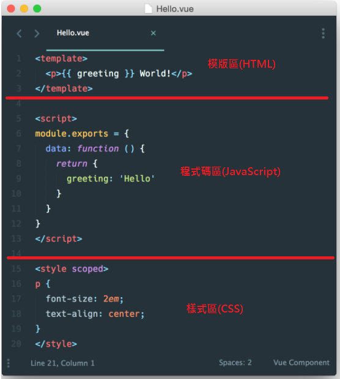

## 8.1 .vue檔案的模版區

上圖中的模版區相當於在Part 6講解組件時，一直使用到的text/x-template，因此上圖的模版區在Part 6時，我們會這麼寫：
```
<script type="text/x-template" id="my-template">
    <p>{{ greeting }} World</p>
</script>
```
它就是組件的template屬性之內容，在Part 6時，我們會這麼寫：
```
Vue.component('parent-component', {
    template: '#my-template'
})
```
**特別注意的是一個.vue檔案只能有一個模版區**。

## 8.2 .vue檔案的程式碼區

程式區域除了可以寫JavaScript程式之外，最重要的其實就是組件的定義，相當於在Part 6組件的創建時，我們會這麼寫：
```
Vue.component('parent-component', {
    template: '#parent-template',
    //parent組件的數據
    data: function() {
        return {
            //這個變數資料會負責存放component名稱,預設是顯示child1-component這個子組件
            currentComponent: 'child1-component'
        }
    },
    底下或許有更多的屬性
})
```
需要特別注意的是在**.vue檔案中的組件定義**，**不需要特別宣告template為何**，它會自己引用模版區來塞入其template屬性。另外**一個.vue檔案只能有一個程式區**

## 8.3 CSS區

此區域可以定義模版中的HTML所要使用的樣式，可以是自己定義的，也可以直接引用外部的.css檔案：
```
<style>
@import url("./assets/app.css");
@import url("./assets/bootstrap.css");
</style>
```
值得注意的是，如果在<stype>中加入**scoped**的話，表示此段樣式只會套用在此**.vue檔案**的模版(template)中，這樣會避開各個vue檔案之間的樣式名稱空間相同的問題：

```<style scoped>樣式...</style>```

**一個.vue檔案能夠有多個CSS模式區**


# Part 9 開發環境的部署

當你把Part 6中的所有組件都變如Part 8的獨立.vue檔案時，**會遇到怎麼把.vue檔案的組件程式碼轉換為 JavaScript 模塊的問題**，**否則你用.vue檔案所寫的組件根本無法在網頁的```<script>```標籤中加載**。有些方法可以讓你進行引進.vue檔案的動作，例如使用require.js, webpack的vue-loader模組, Browserify...等等。但以下我們這裡使用更簡單的**Vue Cli**來一步一步說明如何快速建置一個VueJS的開發專案。

## 9.1 安裝node.js及npm

安裝**Vue Cli套件**之前，我們需要**先安裝完成node.js及npm**。npm 全名為 Node Package Manager，**npm是 Node.js 的套件（package）管理工具**， 類似 Perl 的 ppm 或 PHP 的 PEAR 等。安裝 npm 後，**使用 npm install module_name 指令即可安裝新套件**，維護管理套件的工作會更加輕鬆。**Node.js 在 0.6.3 版本開始內建 npm**，因此我們這裡只說明要安裝node.js即可，其下載網址如下：

[https://nodejs.org/en/download/](https://nodejs.org/en/download/)

安裝完成後，在command mode或Node.js command prompt使用指令測試是否安裝完成：

```npm -v```

若安裝成功node.js及npm，則如下圖所示：

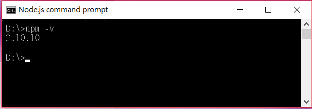

## 9.2 安裝Vue Cli

**Vue-cli 是由 Vue 官方提供的專案樣板工具**，可以快速透過指令建立出一個立即可用的開發環境，**使用npm安裝**如下：

```npm install -g vue-cli```

其中**-g表示把vue-cli指令安裝為全域**，這樣你在任何路徑下都可以使用vue-cli指令

測試安裝成功如下圖示：

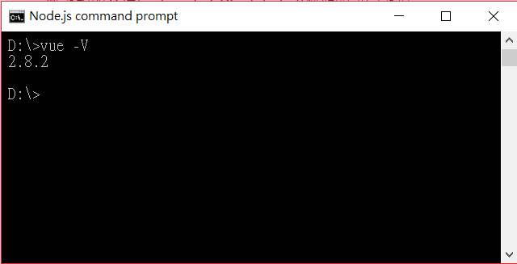

## 9.3 建立Vue專案

安裝好Vue Cli後，可以使用**Vue Cli的list指令**來查看目前Vue官方所提供的樣板有那些：

```vue list```

目前提供的樣板主要是以Browserify或Webpack為基礎的模組整合開發工具，關於這兩者的說明已超出範圍，在此不在細論。各式樣板如下圖示：

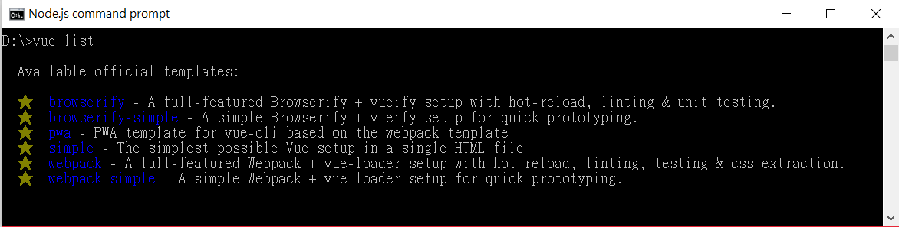

vue-cli 以下列語法建立 vue 專案結構：

```vue init <樣板名稱> <專案名稱>```

我這裡選擇最簡單的**webpack -simple樣板來建置Vue專案**。首先你要選擇一個放置專案的目錄(路徑)，例如：D:\MoHoChiao_gitlab\VueGettingStart\，然後我們將在VueGettingStart資料夾下來建立一個名為Part7_VueFile的Vue專案：

```vue init webpack-simple Part7_VueFile```

執行完成如下圖示：

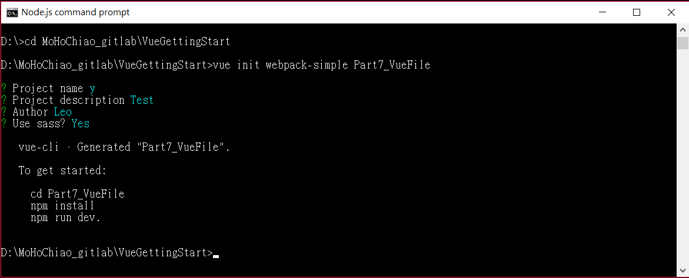

至此我們已經初始化一個Vue專案了，到Part7_VueFile目錄中可以看到檔案分佈如下：

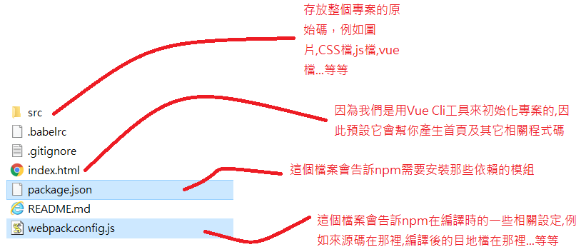

由於是**使用Vue Cli初始化Vue專案**，所以其實初始化動作完成後，**它已經預先幫你建置了一個可用的預設Web APP**，其中index.html即是這個Web APP的首頁，其它相關程式都在放**src目錄**中：

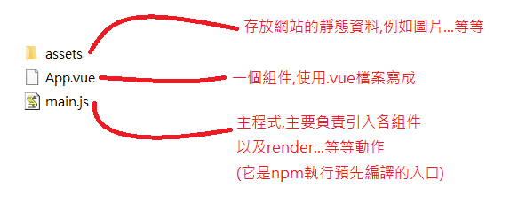

**main.js**檔案的內容如下：
```
import Vue from 'vue'
import App from './App.vue'
new Vue({
  el: '#app',
  render: h => h(App)
})
```
其中import Vue from 'vue'及import App from './App.vue'是所謂**ES2015/16的語法**，**ES2015/16是JavaScript語法的標準沿生**。另外，其中的render: h => h(App)表示使用**Render函數把某個組件渲染到綁定的節點上面去**，在此綁定的節點ID為#app(即index.html中的```<div id="app”>```這個節點)，因此，整句意思是把App這個組件的內容替換到ID為#app的Dom節點裡面。如果在VueJS2.0以前沒有Render這個渲染函數時，我們的寫法應該會如同上述各Part裡所展示的程式碼那樣，也就是你可以這樣寫：
```
new Vue({
    el: '#app',
    components: {
        App,
        //other components
    }
})
```
記得main.js是npm預先編譯所有組件(.vue檔案)以及各相依模組的入口點主程式，你可以把它想像成主程式。主程式的路徑及其檔案名稱可以在webpack.config.js中設定。

## 9.4 安裝Vue專案的依賴模組

我們上述說過npm是一個node.js的模組套件管理工具，它可以透過**package.json檔**來設定開發Vue專案時需要使用(相依)到那些模組，它是使用Vue Cli初始化Vue專案時自動產生的，檔案內容大致如下：

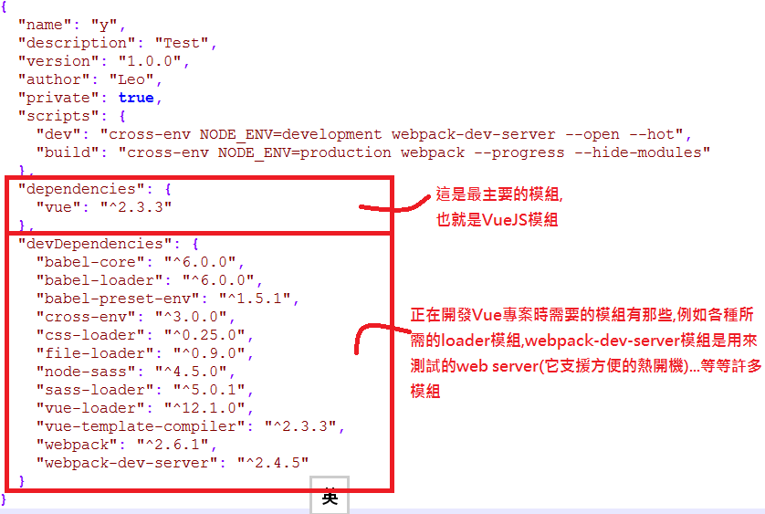

透過上面的設定，我們可以在D:\MoHoChiao_gitlab\VueGettingStart\Part7_VueFile目錄下使用指令(因為Part7_VueFile目錄下才有package.json檔)：

```npm install```

執行安裝完成後可以看到Part7_VueFile目錄下多了一個資料夾名為**node_modules**，它存放我們開發Vue專案時所需要的相依模塊。

## 9.5 編譯Vue專案

當我們用瀏覽器打開Part7_VueFile這個Vue專案下的index.html時，瀏覽器會丟出找不到build.js資源的錯誤，這是因為我們還沒有對這個Vue專案進行過編譯，關於編譯可以透過**webpack.config.js檔**來設定，它是使用Vue Cli初始化Vue專案時自動產生的，裡面包括要編譯的入口程式路徑及檔名(預設src/main.js)、編譯結果丟到那一個目地路徑及檔案(預設dist/build.js)、編譯過程使用到的模組...等等，內容簡略如下：

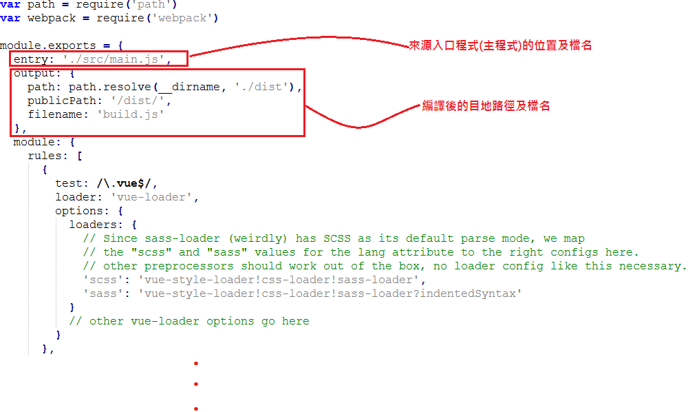

我們在D:\MoHoChiao_gitlab\VueGettingStart\Part7_VueFile目錄下使用指令(因為Part7_VueFile目錄下才有webpack.config.js檔)：

```npm run build```

編譯成功後，如下圖示：

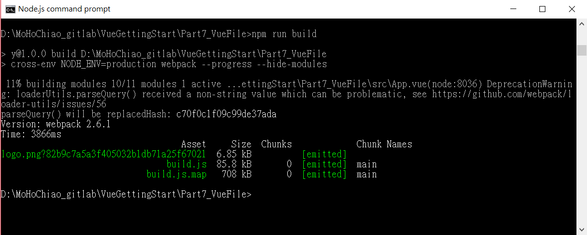

此時在Part7_VueFile會多一個名為dist的目錄，這個目錄代表最終的編譯結果，裡面會有src來源碼資料夾的所有靜態檔案(圖檔、CSS樣式檔)以及build.js檔案，build.js檔是所有APP中的組件及其相依模組編譯過後的最終JS程式檔。實際上，你只要在任何HTML檔案引用這個build.js檔案，如果一切資源的路徑位置(圖,CSS,JS,HTML)你都有放對，它們立刻可以在任何Web Server(Apache,Tomcat,Jetty...等等)上執行。**引用最終編譯出來的build.js檔之HTML範例如下圖示**：

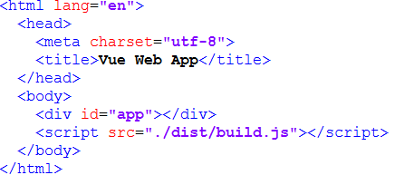

## 9.6 執行Vue專案

當我們如9.4節編譯好Vue專案後，接著使用如下指令即可熱佈署網站到webpack develope web server：

```npm run dev```

接著在瀏覽器的http://localhost:8080/顯示畫面如下：

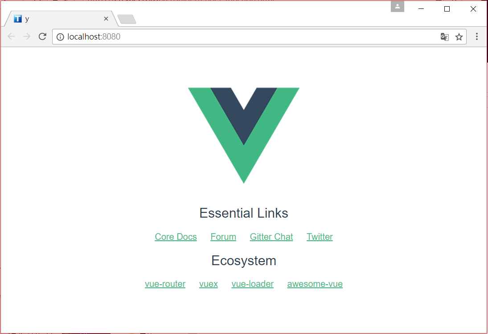

這個Web APP就是我們使用Vue Cli來初始化及建立一個Vue專案時，它所自己預設的APP，至此我們已經學會了如何初始化、開發、建置、以及佈署一個Vue專案了。特別注意的是其實可以不用先對Vue專案做build(編譯)的動作，試著把dist資料夾刪除後再執行npm run dev，你會發現一樣可以執行這個Web APP成功，這是因為webpack develope web server為了方便開發及測試，不用每次都先build專案才能執行，而且它還是熱佈署，只要你web server不關掉，它可以時時跟著你目前的最新版本程式碼來自動更新顯示**(Hot-loader)**。至於build出來的程式碼，也就是dist資料夾內容，它主要是給production環境中來使用。

## 9.7 建立及佈署自己的Vue APP專案

我們會替換掉用Vue Cli初始化Vue專案後，它所預設的APP之內容。我們的專案內容很簡單，設計兩個子組件，它們的功能幾乎一樣，都是顯示自己的資料狀態、接收從父組件傳來的資料數據、以及利用事件通知父組件。再用一個父組件組合這兩個子組件，這父組件能動態的改變子組件的props值以及接收子組所丟出的事件。最後再修改原本的main.js檔案的內容，變成去import這個父組件來綁定在dom節點上。

第一個子組件的***[child1_component.vue](./src/components/child1_component.vue)***檔內容如下：
```
<template>
    <div id="child1">
        <!--顯示從組件本身data來的message資料-->
        <p>子組件本身的dataMessage值：{{ dataMessage }}</p>
        <!--顯示組件所接收到的外部message及type之資料-->
        <p>子組件所接收到的外部(父組件)來的propsMessage值：{{ propsMessage }}</p>
        <p>子組件所接收到的外部(父組件)來的type值：{{ type }}</p>
        <button v-on:click="increment">{{ counter }}</button>
    </div>
</template>
<script>
export default {
    //template屬性不用給,預設就會塞入.vue檔裡面的template
    //給這個子組件一個名字
    name: 'child1',
    props: ['type', 'propsMessage'],
    data() {
        return {
            dataMessage: 'This child component 1',
            counter: 0
        }
    },
    methods: {
        increment: function() {
            this.counter += 1
            //向外界(父組件)丟出事件(觸發事件),事件有沒有人處理不要緊
            this.$emit('increment')
        }
    }
}
</script>
<style scoped>
p {
    color: red;
    font-size: 20px;
    text-align: left;
}
</style>
```
第二個子組件的***[child2_component.vue](./src/components/child2_component.vue)***檔內容如下：
```
<template>
    <div id="child2">
        <!--顯示從組件本身data來的message資料-->
        <p>子組件本身的dataMessage值：{{ dataMessage }}</p>
        <!--顯示組件所接收到的外部message及type之資料-->
        <p>子組件所接收到的外部(父組件)來的propsMessage值：{{ propsMessage }}</p>
        <p>子組件所接收到的外部(父組件)來的type值：{{ type }}</p>
        <button v-on:click="increment">{{ counter }}</button>
    </div>
</template>
<script>
export default {
    //template屬性不用給,預設就會塞入.vue檔裡面的template
    //給這個子組件一個名字
    name: 'child2',
    props: ['type', 'propsMessage'],
    data() {
        return {
            dataMessage: 'This child component 2',
            counter: 0
        }
    },
    methods: {
        increment: function() {
            this.counter += 1
            //向外界(父組件)丟出事件(觸發事件),事件有沒有人處理不要緊
            this.$emit('increment')
        }
    }
}
</script>
<style scoped>
p {
    color: blue;
    font-size: 20px;
    text-align: left;
}
</style>
```
父組件的***[parent_component.vue](./src/components/parent_component.vue)***檔內容如下：
```
<template>
    <div id="parent">
        <!--宣到兩個使用v-model雙向綁定的input元素-->
        <p>type：
            <input type="text" v-model="parent_type" />
        </p>
        <p>message：
            <input type="text" v-model="parent_message" />
        </p>
        <!--在引用<child-component>這個組件時,給它傳遞兩個參數過去,且參數值動態地單向綁定在父組件的data屬性-->
        <!--即父組件的data屬性變動,則此子組件的props屬性也跟著變動-->
        <!--特別注意!上述反之不成立,資料綁定是單向的資料流,即子組件的props屬性變動不會改變父組件之data屬性-->
        <!--單向資料流是為了防止子組件無意修改了父組件的狀態,因此這會讓資料流變的難以理解,增加debug困難-->
        <!--v-on指令綁定了事件,即子組件若從它的increment方法丟出事件來,父組件則用incrementTotal方法來處理-->
        <child1-component v-bind:type="parent_type" v-bind:props-message="parent_message" v-on:increment="incrementTotal"></child1-component>
        <child2-component v-bind:type="parent_type" v-bind:props-message="parent_message" v-on:increment="incrementTotal"></child2-component>
        <p>兩個子組件共計按鈕的次數：{{ total }}</p>
    </div>
</template>
<script>
//ES2015/16的語法,表示引入兩個.vue檔案的組件
import Child1 from './child1_component.vue'
import Child2 from './child2_component.vue'
export default {
    //template屬性不用給,預設就會塞入.vue檔裡面的template
    //給這個子組件一個名字
    name: 'parent',
    data() {
        return {
            parent_type: 'child',
            parent_message: 'Hi, My child.',
            total: 0
        }
    },
    components: {
        //私域註冊兩個Child組件為此父組件的子組件,因為私域,所以該組件只能在Parent組件內使用
        'child1-component': Child1,
        'child2-component': Child2
    },
    methods: {
        incrementTotal: function() {
            this.total += 1
        }
    }
}
</script>
<style scoped>
p {
    color: black;
    font-size: 30px;
    text-align: left;
}
</style>
```
修改過後的***[main.js](./src/main.js)***檔(即主程式或稱npm編譯的入口程式)，我們import上面的parent component進來：
```
import Vue from 'vue'
import Parent from './components/parent_component.vue'
new Vue({
    el: '#app',
    render: h => h(Parent)
})
```
程式都寫完之後，根據Part 8的內容所述，我們可以對Vue專案執行```npm run build```指令後，得到最終編譯的build.js檔，再使用任意的HTML檔案來引用它，引用build.js檔的HTML檔案範例如下：
```
<!DOCTYPE html>
<html lang="en">
  <head>
    <meta charset="utf-8">
    <title>Vue Web App</title>
  </head>
  <body>
    <!--這個建立一個div,其id為app,這是讓build.js中的VueJS實體來渲染的區域-->
    <div id="app"></div>
    <!--在這裡引用剛剛編譯完成的JS檔案,這個JS檔的內容包括上述所有Vue實體,父組件,兩個子組件的內容之編譯-->
    <script src="./dist/build.js"></script>
  </body>
</html>
```
同樣地，依據Part 8內容所述，我們也可以對Vue專案執行```npm run dev```指令，利用webpack develope web server啟動來觀看網頁內容(或你用任何web server, ex:apache,tomcat,jetty..等等)，網址```http://localhost:8080/```顯示畫面如下：

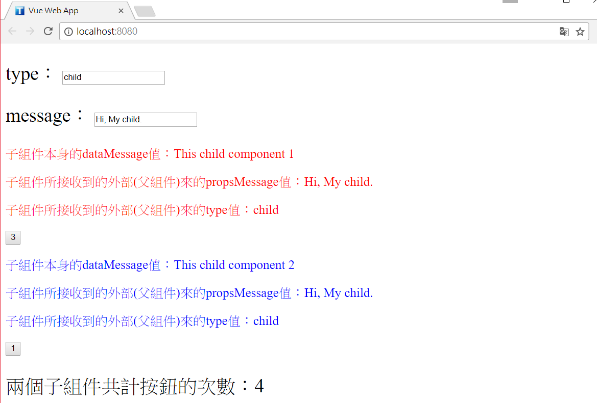